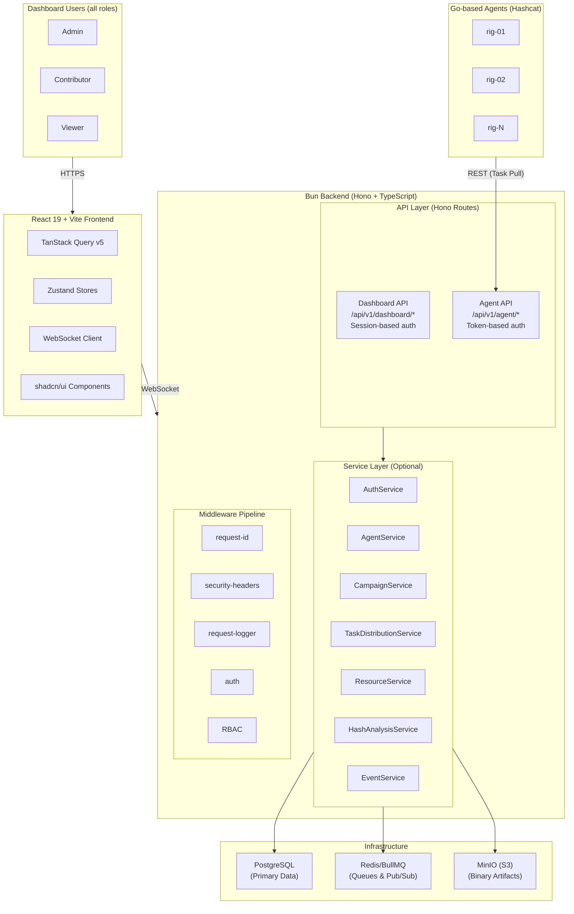
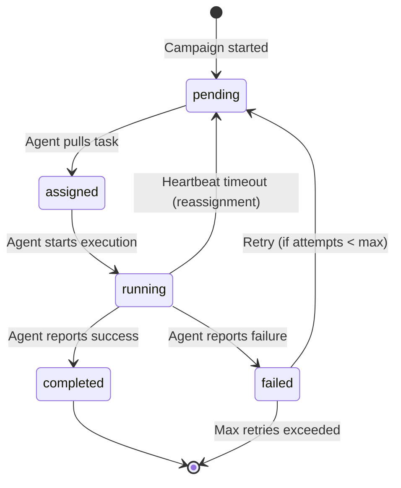
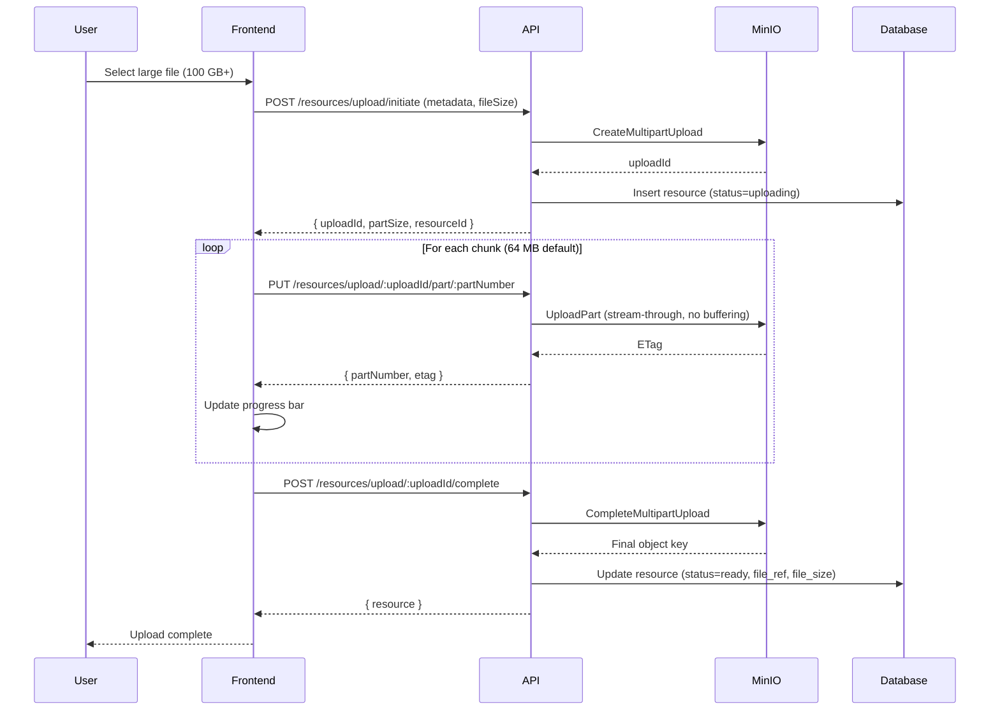
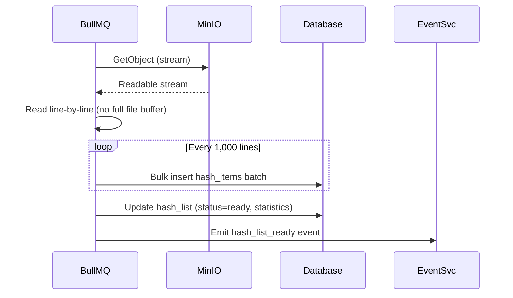
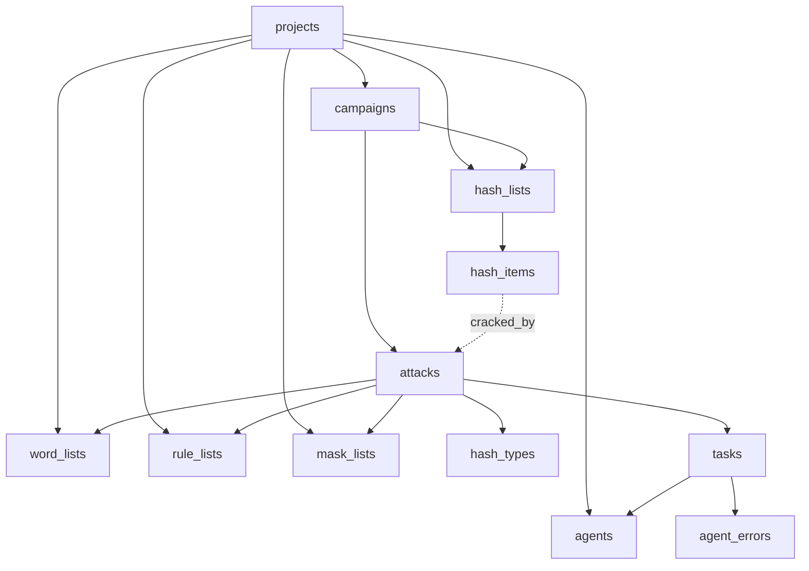

# Design Document

## Overview

HashHive is a modern TypeScript implementation that replaces the Rails-based CipherSwarm platform. The system orchestrates distributed password cracking across multiple agents using hashcat, providing campaign management, intelligent task distribution, real-time monitoring, and comprehensive resource management. The architecture uses TypeScript throughout, with **Bun** as the runtime and package manager, **Hono** framework running natively on Bun.serve(), **PostgreSQL with Drizzle ORM** for data persistence, **BullMQ/Redis** for job queuing, **MinIO** (S3-compatible storage) for binary artifacts, and **React 19 + Vite** for the operator-facing web UI.

**Key Architectural Principles:**

- **Drizzle schemas as single source of truth**: All database tables defined in `packages/shared/src/db/schema.ts`, Zod schemas generated via drizzle-zod, types inferred via `z.infer<typeof schema>`
- **No premature abstraction**: Hono route handlers can call Drizzle queries directly; service layers only when needed
- **Bulk operations for Agent API**: Use Drizzle batch inserts or raw Bun.SQL for hash submissions
- **Queue-based async processing**: BullMQ/Redis for hash list parsing, task generation, heartbeat monitoring
- **Periodic burst traffic**: Agent API handles periodic bursts when agents submit results, request work, and send heartbeats
- **Low-traffic Dashboard API**: Standard REST for 1-3 concurrent users
- **Real-time via WebSockets**: hono/websocket for dashboard updates (agent heartbeats, crack results); in-memory broadcasting for v1 with Redis pub/sub as documented extension path
- **MinIO for artifacts**: S3-compatible storage for hash lists, wordlists, rulelists, and masklists
- **Streaming for large files**: Resource files (wordlists, masklists) routinely exceed 100 GB; all uploads use S3 multipart upload with chunked frontend transfers, all downloads use presigned URLs (agents fetch directly from MinIO), and all parsing streams line-by-line — the backend never buffers an entire file in memory
- **Streaming for large files**: Resource files (wordlists, masklists, rulelists) routinely exceed 100 GB; all upload/download paths use streaming I/O with no full-file buffering in memory
- **Turborepo + Bun workspaces**: Monorepo with workspace packages (backend, frontend, shared, openapi)
- **Optimize for correctness and clarity**: Not premature scale; private lab environment with 7 cracking rigs

## Architecture

### High-Level System Architecture



### Technology Stack

**Backend:**

- Bun (latest stable, currently 1.3.x) as runtime, package manager, and test runner
- Hono framework running natively on Bun.serve()
- PostgreSQL with Drizzle ORM for type-safe database access
- Drizzle table definitions in `packages/shared/src/db/schema.ts` as single source of truth
- drizzle-zod for generating Zod schemas from Drizzle tables
- Zod for all data validation with types inferred via `z.infer<typeof schema>`
- hono/websocket for real-time updates (in-memory v1, Redis pub/sub extension path)
- Pino for structured logging

**Frontend:**

- React 19 with TypeScript
- Vite for build tooling (not Next.js, not CRA)
- Tailwind CSS for styling
- shadcn/ui for components (copied into project via CLI)
- React Hook Form + Zod resolvers for forms
- TanStack Query v5 for all server state
- Zustand for client-side UI state (no Redux, no Context API)
- WebSocket client for real-time updates with polling fallback

**Infrastructure:**

- PostgreSQL for primary data storage
- Redis for BullMQ job queues (required dependency)
- MinIO (S3-compatible) for binary artifacts (hash lists, wordlists, rulelists, masklists)
- Docker Compose for local development (PostgreSQL, Redis, MinIO)

**Tooling:**

- Bun for package management (exclusively, no npm, yarn, or pnpm)
- Turborepo for monorepo orchestration and caching
- bun:test for all tests (Bun's built-in test runner)
- Biome for linting, formatting, and import sorting

### Schema-First Architecture

```text
Drizzle table definitions (packages/shared/src/db/schema.ts)
  ↓ drizzle-kit generate
Migrations (packages/shared/src/db/migrations/)
  ↓ drizzle-zod
Zod schemas (packages/shared/src/schemas/index.ts)
  ↓ z.infer<typeof schema>
TypeScript types (packages/shared/src/types/)
```

All data shapes flow in one direction from Drizzle tables. No manually duplicated TypeScript interfaces. Both backend (Hono validation via `@hono/zod-validator`) and frontend (form validation, TanStack Query typing) consume shared schemas from `@hashhive/shared`.


## Components and Interfaces

### Backend Service Modules

#### 1. AuthService (`packages/backend/src/services/auth.ts`)

**Responsibilities:**

- User authentication (login, logout, JWT generation)
- Session management with HttpOnly cookies
- JWT token validation for Dashboard API requests
- Agent pre-shared token validation
- Password hashing and verification

**Key Methods:**

- `login(email, password): Promise<{ user, token, session }>`
- `validateToken(token): Promise<User>`
- `validateSession(sessionId): Promise<User>`
- `logout(sessionId): Promise<void>`
- `validateAgentToken(token): Promise<Agent>`

**Dependencies:**

- Drizzle ORM for user/agent queries
- bcrypt for password hashing
- JWT library for token operations

#### 2. ProjectService (`packages/backend/src/services/projects.ts`)

**Responsibilities:**

- Project CRUD operations
- Project membership management
- Role assignment and validation (roles stored as text array on project_users)
- Project-scoped data filtering

**Key Methods:**

- `createProject(data): Promise<Project>`
- `addUserToProject(projectId, userId, roles): Promise<void>`
- `getUserProjects(userId): Promise<Project[]>`
- `validateProjectAccess(userId, projectId, requiredRole): Promise<boolean>`

**Dependencies:**

- Drizzle ORM for projects, project_users tables
- AuthService for user validation

#### 3. AgentService (`packages/backend/src/services/agents.ts`)

**Responsibilities:**

- Agent registration and authentication
- Capability detection and storage (OS, hashcat version, GPU models, CPU specs)
- Heartbeat processing and status tracking
- Agent error logging with severity classification

**Key Methods:**

- `registerAgent(credentials, capabilities): Promise<Agent>`
- `processHeartbeat(agentId, status, deviceInfo): Promise<void>`
- `getAgentsByProject(projectId, filters): Promise<Agent[]>`
- `logAgentError(agentId, error): Promise<void>`

**Dependencies:**

- Drizzle ORM for agents, agent_errors, operating_systems tables
- EventService for status broadcasts

#### 4. CampaignService (`packages/backend/src/services/campaigns.ts`)

**Responsibilities:**

- Campaign lifecycle management (draft → running → paused → completed → cancelled)
- Attack configuration and validation
- DAG dependency resolution and cycle detection
- Campaign execution orchestration
- Progress calculation and caching

**Key Methods:**

- `createCampaign(projectId, config): Promise<Campaign>`
- `addAttack(campaignId, attackConfig): Promise<Attack>`
- `validateAttackDAG(campaignId): Promise<boolean>`
- `startCampaign(campaignId): Promise<void>`
- `pauseCampaign(campaignId): Promise<void>`
- `stopCampaign(campaignId): Promise<void>` (returns to draft)

**Circular Import Note:** `campaigns.ts` and `tasks.ts` have a circular dependency resolved via dynamic `await import('./tasks.js')`. Maintain this pattern for cross-service calls.

**Dependencies:**

- Drizzle ORM for campaigns, attacks tables
- TaskDistributionService for task generation
- HashAnalysisService for validation

#### 5. TaskDistributionService (`packages/backend/src/services/tasks.ts`)

**Responsibilities:**

- Task generation from attack keyspace (hybrid sync/async: sync for <100 tasks, async via BullMQ for ≥100)
- Keyspace partitioning into work ranges
- Queue management with BullMQ priority queues (tasks:high, tasks:normal, tasks:low)
- Capability-based task assignment (DB-level predicate, no post-filtering)
- Task progress tracking and reassignment for offline agents

**Key Methods:**

- `generateTasks(attackId): Promise<Task[]>`
- `enqueueTask(task, capabilities): Promise<void>`
- `getNextTask(agentId, capabilities): Promise<Task | null>`
- `reportTaskProgress(taskId, progress): Promise<void>`
- `handleTaskFailure(taskId, reason): Promise<void>`

**Task Lifecycle:**



**Dependencies:**

- Drizzle ORM for tasks, attacks tables
- BullMQ for queue operations
- AgentService for capability matching

#### 6. ResourceService (`packages/backend/src/services/resources.ts`)

**Responsibilities:**

- Resource metadata management (hash lists, wordlists, rulelists, masklists)
- Streaming file upload to MinIO via S3 multipart upload (never buffer entire files in memory)
- Hash list parsing coordination (enqueue BullMQ job)
- Resource access control (project-scoped)
- Presigned URL generation for agent downloads (agents fetch files directly from MinIO)

**Large File Strategy (100 GB+):**

Resource files (wordlists, masklists, rulelists) routinely exceed 100 GB. The system handles this with:

- **Frontend → Backend:** Chunked uploads via `tus` protocol or custom chunked upload endpoint. Frontend splits files into configurable chunks (default 64 MB), uploads sequentially with progress tracking, and supports resumption on network interruption.
- **Backend → MinIO:** S3 multipart upload. Backend streams each incoming chunk directly to MinIO as a multipart part without buffering the full file. On completion, issues `CompleteMultipartUpload`.
- **MinIO → Agents:** Presigned URLs. Agents download resources directly from MinIO, bypassing the backend entirely. No backend memory pressure during agent downloads.
- **Hash list parsing:** BullMQ worker streams the file from MinIO line-by-line using `GetObject` with a readable stream, inserting hash_items in batches of 1,000. Never loads the full file into memory.
- **Memory budget:** Backend process should never hold more than ~128 MB of file data in memory at any point, regardless of file size.

**Key Methods:**

- `initiateUpload(projectId, metadata): Promise<{ uploadId, presignedParts }>` (for chunked uploads)
- `completeUpload(uploadId, parts): Promise<Resource>` (finalize multipart upload)
- `uploadHashList(projectId, file, metadata): Promise<HashList>` (small files, direct upload)
- `parseHashList(hashListId): Promise<void>` (enqueues BullMQ job, streams from MinIO)
- `uploadWordlist(projectId, file, metadata): Promise<WordList>`
- `getResourcesByProject(projectId, type): Promise<Resource[]>`
- `generatePresignedUrl(resourceId): Promise<string>` (for agent downloads)

**Large File Upload Flow:**



**Small File Upload Flow (< 100 MB):**

For files under 100 MB, the existing single-request multipart form upload is used (streamed directly to MinIO via `PutObject`).

**Hash List Parsing Flow (streaming):**



**Dependencies:**

- Drizzle ORM for hash_lists, word_lists, rule_lists, mask_lists tables
- MinIO S3 client for object storage
- BullMQ for async hash list parsing
- HashAnalysisService for hash type detection

#### 7. HashAnalysisService (`packages/backend/src/services/hash-analysis.ts`)

**Responsibilities:**

- Hash type identification using name-that-hash library
- Hashcat mode mapping and validation
- Hash format validation against mode requirements
- Confidence scoring for hash type candidates

**Key Methods:**

- `guessHashType(hashContent): Promise<HashTypeGuess[]>`
- `validateHashFormat(hash, hashcatMode): Promise<boolean>`
- `getHashcatModeInfo(mode): Promise<HashType>`

**Dependencies:**

- Drizzle ORM for hash_types table
- name-that-hash library integration

#### 8. EventService (`packages/backend/src/services/events.ts`)

**Responsibilities:**

- Real-time event broadcasting (in-memory for v1)
- WebSocket connection management via hono/websocket
- Project-scoped event filtering
- Event throttling to prevent performance degradation

**Event Types:**

- `agent_status`: Agent online/offline/error state changes
- `campaign_status`: Campaign started/paused/stopped/completed
- `task_update`: Task progress, completion, failure
- `crack_result`: New hash cracked

**Key Methods:**

- `broadcast(event): Promise<void>`
- `broadcastToProject(projectId, event): Promise<void>`
- `subscribe(userId, projectId, eventTypes): EventStream`
- `unsubscribe(connectionId): Promise<void>`

**Dependencies:**

- hono/websocket for WebSocket infrastructure
- Redis pub/sub (future multi-instance extension path)

### API Endpoints

#### Dashboard API (`/api/v1/dashboard/*`)

**Authentication:** JWT + HttpOnly session cookies
**Traffic:** Low (1-3 concurrent users)
**Project Scoping:** `projectId` embedded in JWT, read from `c.get('currentUser').projectId`
**Pattern:** Standard REST CRUD operations with Zod validation via `@hono/zod-validator`

**Authentication:**

```typescript
POST /auth/login         → { user, token, session }
POST /auth/logout        → { success: true }
GET  /auth/me            → { user, projects, roles }
```

**Projects:**

```typescript
GET    /projects         → { projects: Project[] }
POST   /projects         → { project: Project }
GET    /projects/:id     → { project: Project }
PATCH  /projects/:id     → { project: Project }
```

**Agents:**

```typescript
GET   /agents            → { agents: Agent[], pagination }
GET   /agents/:id        → { agent: Agent, recentErrors, performance }
PATCH /agents/:id        → { agent: Agent }
```

**Campaigns:**

```typescript
GET  /campaigns          → { campaigns: Campaign[], pagination }
POST /campaigns          → { campaign: Campaign }
GET  /campaigns/:id      → { campaign: Campaign, attacks, progress }
POST /campaigns/:id/start  → { campaign: Campaign }
POST /campaigns/:id/pause  → { campaign: Campaign }
POST /campaigns/:id/stop   → { campaign: Campaign }
```

**Resources:**

```typescript
GET  /resources/hash-lists          → { hashLists: HashList[] }
POST /resources/hash-lists          → { hashList: HashList }  (multipart, small files)
POST /resources/hash-lists/:id/import → { job: ImportJob }
GET  /resources/word-lists          → { wordLists: WordList[] }
POST /resources/word-lists          → { wordList: WordList }  (multipart, small files)

// Chunked upload endpoints (for files > 100 MB, required for 100 GB+ resources)
POST /resources/upload/initiate     → { uploadId, partSize, resourceId }
PUT  /resources/upload/:uploadId/part/:partNumber → { partNumber, etag }
POST /resources/upload/:uploadId/complete → { resource }
DELETE /resources/upload/:uploadId   → { cancelled: true }  (abort incomplete upload)
```

**Hash Analysis:**

```typescript
POST /hashes/guess-type  → { candidates: HashTypeGuess[] }
```

**Results:**

```typescript
GET /results             → { results: CrackedHash[], pagination }
GET /results/export      → CSV file download
```

**Stats:**

```typescript
GET /stats               → { agents, campaigns, tasks, crackedHashes }
```

**Events:**

```typescript
GET /events/stream       → WebSocket upgrade (project-scoped)
```

#### Agent API (`/api/v1/agent/*`)

**Authentication:** Pre-shared token (sent on every request, no JWT exchange)
**Traffic:** Batch operations for periodic bursts
**Contract:** Defined in `packages/openapi/agent-api.yaml`

```typescript
POST /agent/sessions           → { sessionToken, config }
POST /agent/heartbeat          → { acknowledged, hasHighPriorityTasks }
POST /agent/tasks/next         → { task: Task | null }
POST /agent/tasks/:id/report   → { acknowledged: true }
  // Uses Drizzle batch inserts or raw Bun.SQL for hash results
```

### RBAC Middleware

Two RBAC middleware variants in `packages/backend/src/middleware/rbac.ts`:

- `requireProjectAccess()` / `requireRole()` — reads projectId from JWT context (`currentUser.projectId`); used by most dashboard routes
- `requireParamProjectAccess()` / `requireParamProjectRole()` — reads projectId from URL param (`c.req.param('projectId')`); used by project management routes

**Middleware Pipeline:** request-id → security-headers → request-logger → auth → RBAC → route handler


## Data Models

### PostgreSQL Tables

All tables defined using Drizzle ORM in `packages/shared/src/db/schema.ts` as the single source of truth. All tables use `serial` primary keys and `timestamp` fields for audit trails.

#### Identity & Access

**users**

```typescript
{
  id: serial PRIMARY KEY,
  email: varchar(255) UNIQUE NOT NULL,
  password_hash: varchar(255) NOT NULL,
  name: varchar(255) NOT NULL,
  status: varchar(20) DEFAULT 'active',  // 'active' | 'disabled'
  last_login_at: timestamp,
  created_at: timestamp DEFAULT now(),
  updated_at: timestamp DEFAULT now()
}
```

**projects**

```typescript
{
  id: serial PRIMARY KEY,
  name: varchar(255) NOT NULL,
  description: text,
  slug: varchar(255) UNIQUE NOT NULL,
  settings: jsonb DEFAULT '{}',
  created_by: integer REFERENCES users(id),
  created_at: timestamp DEFAULT now(),
  updated_at: timestamp DEFAULT now()
}
```

**project_users**

```typescript
{
  id: serial PRIMARY KEY,
  user_id: integer REFERENCES users(id) NOT NULL,
  project_id: integer REFERENCES projects(id) NOT NULL,
  roles: text[] NOT NULL,  // ['admin'] | ['contributor'] | ['viewer']
  created_at: timestamp DEFAULT now(),
  UNIQUE(user_id, project_id)
}
```

#### Agents & Telemetry

**operating_systems**

```typescript
{
  id: serial PRIMARY KEY,
  name: varchar(255) NOT NULL,
  version: varchar(100),
  platform: varchar(100)
}
```

**agents**

```typescript
{
  id: serial PRIMARY KEY,
  name: varchar(255) NOT NULL,
  project_id: integer REFERENCES projects(id) NOT NULL,
  operating_system_id: integer REFERENCES operating_systems(id),
  auth_token: varchar(255) UNIQUE NOT NULL,
  status: varchar(20) DEFAULT 'offline',  // 'online' | 'offline' | 'busy' | 'error'
  capabilities: jsonb DEFAULT '{}',       // GPU models, hashcat version, supported modes
  hardware_profile: jsonb DEFAULT '{}',   // CPU specs, RAM, OS details, driver versions
  last_seen_at: timestamp,
  current_task_id: integer REFERENCES tasks(id),
  created_at: timestamp DEFAULT now(),
  updated_at: timestamp DEFAULT now()
}
```

**agent_errors**

```typescript
{
  id: serial PRIMARY KEY,
  agent_id: integer REFERENCES agents(id) NOT NULL,
  severity: varchar(20) NOT NULL,  // 'warning' | 'error' | 'fatal'
  message: text NOT NULL,
  context: jsonb DEFAULT '{}',
  task_id: integer REFERENCES tasks(id),
  created_at: timestamp DEFAULT now()
}
```

#### Campaign Orchestration

**campaigns**

```typescript
{
  id: serial PRIMARY KEY,
  project_id: integer REFERENCES projects(id) NOT NULL,
  name: varchar(255) NOT NULL,
  description: text,
  hash_list_id: integer REFERENCES hash_lists(id) NOT NULL,
  status: varchar(20) DEFAULT 'draft',  // 'draft' | 'running' | 'paused' | 'completed' | 'cancelled'
  priority: integer DEFAULT 5,          // 1-10
  metadata: jsonb DEFAULT '{}',
  created_by: integer REFERENCES users(id),
  started_at: timestamp,
  completed_at: timestamp,
  created_at: timestamp DEFAULT now(),
  updated_at: timestamp DEFAULT now()
}
```

**attacks**

```typescript
{
  id: serial PRIMARY KEY,
  campaign_id: integer REFERENCES campaigns(id) NOT NULL,
  project_id: integer REFERENCES projects(id) NOT NULL,
  mode: integer NOT NULL,  // hashcat attack mode
  hash_type_id: integer REFERENCES hash_types(id),
  wordlist_id: integer REFERENCES word_lists(id),
  rulelist_id: integer REFERENCES rule_lists(id),
  masklist_id: integer REFERENCES mask_lists(id),
  advanced_configuration: jsonb DEFAULT '{}',
  keyspace: varchar(255),
  status: varchar(20) DEFAULT 'pending',  // 'pending' | 'running' | 'completed' | 'failed'
  dependencies: integer[],  // array of attack IDs (DAG edges)
  template_id: integer,
  created_at: timestamp DEFAULT now(),
  updated_at: timestamp DEFAULT now()
}
```

**tasks**

```typescript
{
  id: serial PRIMARY KEY,
  attack_id: integer REFERENCES attacks(id) NOT NULL,
  campaign_id: integer REFERENCES campaigns(id) NOT NULL,
  agent_id: integer REFERENCES agents(id),
  status: varchar(20) DEFAULT 'pending',  // 'pending' | 'assigned' | 'running' | 'completed' | 'failed'
  work_range: jsonb DEFAULT '{}',         // { skip: number, limit: number }
  progress: jsonb DEFAULT '{}',           // { percent: number, speed: number, eta_seconds: number }
  result_stats: jsonb DEFAULT '{}',       // { hashes_cracked: number, total_hashes: number }
  assigned_at: timestamp,
  started_at: timestamp,
  completed_at: timestamp,
  failure_reason: text,
  created_at: timestamp DEFAULT now(),
  updated_at: timestamp DEFAULT now()
}
```

#### Resources

**hash_types**

```typescript
{
  id: serial PRIMARY KEY,
  name: varchar(255) NOT NULL,
  hashcat_mode: integer NOT NULL,
  category: varchar(100),
  example: text
}
```

**hash_lists**

```typescript
{
  id: serial PRIMARY KEY,
  project_id: integer REFERENCES projects(id) NOT NULL,
  name: varchar(255) NOT NULL,
  hash_type_id: integer REFERENCES hash_types(id),
  source: varchar(50) DEFAULT 'upload',  // 'upload' | 'import' | 'api'
  file_ref: jsonb DEFAULT '{}',          // { bucket, key, contentType, size, uploadedAt }
  statistics: jsonb DEFAULT '{}',        // { total_hashes, cracked_hashes, unique_hashes }
  status: varchar(20) DEFAULT 'uploading',  // 'uploading' | 'parsing' | 'ready' | 'error'
  created_at: timestamp DEFAULT now(),
  updated_at: timestamp DEFAULT now()
}
```

**hash_items**

```typescript
{
  id: serial PRIMARY KEY,
  hash_list_id: integer REFERENCES hash_lists(id) NOT NULL,
  hash_value: varchar(255) NOT NULL,
  plaintext: text,
  cracked_at: timestamp,
  metadata: jsonb DEFAULT '{}',  // { salt, username }
  created_at: timestamp DEFAULT now()
}
// UNIQUE(hash_list_id, hash_value) — use onConflictDoUpdate for crack result attribution
```

**word_lists, rule_lists, mask_lists**

```typescript
{
  id: serial PRIMARY KEY,
  project_id: integer REFERENCES projects(id) NOT NULL,
  name: varchar(255) NOT NULL,
  file_ref: jsonb DEFAULT '{}',  // { bucket, key, contentType, size, uploadedAt, uploadId }
  line_count: bigint,            // bigint to support files with billions of lines
  file_size: bigint,             // bigint required: files routinely exceed 100 GB
  status: varchar(20) DEFAULT 'uploading',  // 'uploading' | 'ready' | 'error'
  created_at: timestamp DEFAULT now(),
  updated_at: timestamp DEFAULT now()
}
```

### Indexes for Hot Paths

- `tasks(status, agent_id)` — Agent task queries
- `tasks(campaign_id, status)` — Campaign progress aggregation
- `hash_items(hash_list_id, hash_value)` UNIQUE — Import idempotency and fast membership checks
- `hash_items(hash_value)` — Hash lookup during crack result ingestion
- `hash_items(hash_list_id, cracked_at)` — Crack rate calculations
- `agents(project_id, status)` — Agent list filtering
- `campaigns(project_id, status)` — Campaign list filtering

### Key Relationships



### Zod Validation Schemas

Single source of truth using drizzle-zod in `packages/shared/src/schemas/index.ts`:

```typescript
import { createInsertSchema, createSelectSchema } from 'drizzle-zod';
import { z } from 'zod';
import { users, projects, campaigns, agents } from '../db/schema';

// Generate base schemas from Drizzle tables
export const insertUserSchema = createInsertSchema(users);
export const selectUserSchema = createSelectSchema(users);
export const insertCampaignSchema = createInsertSchema(campaigns);
export const selectCampaignSchema = createSelectSchema(campaigns);

// Infer TypeScript types from Zod schemas
export type InsertUser = z.infer<typeof insertUserSchema>;
export type SelectUser = z.infer<typeof selectUserSchema>;
export type InsertCampaign = z.infer<typeof insertCampaignSchema>;
export type SelectCampaign = z.infer<typeof selectCampaignSchema>;

// Custom validation schemas for API requests
export const loginRequestSchema = z.object({
  email: z.string().email(),
  password: z.string().min(8)
});

export const createCampaignSchema = insertCampaignSchema.pick({
  projectId: true, name: true, description: true, hashListId: true, priority: true
});

export const agentHeartbeatSchema = z.object({
  status: z.enum(['online', 'busy', 'error']),
  capabilities: z.object({
    hashcatVersion: z.string(),
    gpuDevices: z.array(z.object({
      name: z.string(), memory: z.number(), computeCapability: z.string()
    }))
  }),
  deviceInfo: z.object({
    cpuUsage: z.number(), memoryUsage: z.number(), temperature: z.number().optional()
  })
});
```


## Correctness Properties

*A property is a characteristic or behavior that should hold true across all valid executions of a system — essentially, a formal statement about what the system should do. Properties serve as the bridge between human-readable specifications and machine-verifiable correctness guarantees.*

### Property 1: Agent token authentication round-trip

*For any* agent with a valid pre-shared token, authenticating via the Agent API should succeed and return the correct agent context (agent_id, project_id). *For any* invalid or missing token, the system should reject the request with a 401 error.

**Validates: Requirements 2.1, 7.1, 9.2**

### Property 2: JWT session round-trip

*For any* user with valid credentials, logging in should produce a JWT that, when validated, returns the same user identity and project memberships. *For any* expired or tampered JWT, validation should fail.

**Validates: Requirements 2.2, 2.3**

### Property 3: RBAC enforcement

*For any* user with a given role (Admin, Contributor, or Viewer) and *for any* API operation, the system should allow the operation if and only if the role has permission. Specifically: Admin can perform all operations; Contributor can create/manage campaigns and resources but not manage users/projects; Viewer can only read campaigns, resources, and results.

**Validates: Requirements 3.1, 3.3, 3.4, 3.5, 3.6**

### Property 4: Project-scoped data isolation

*For any* authenticated user and *for any* data query, the results should contain only data belonging to the user's current project. No query should ever return data from a project the user does not have access to.

**Validates: Requirements 3.2, 14.13**

### Property 5: Authentication returns complete profile

*For any* authenticated user, the GET /auth/me response should include the user's profile, all project memberships, and the assigned role for each project.

**Validates: Requirements 2.3, 3.7**

### Property 6: Event emission on state change

*For any* state change in the system (agent status change, campaign status change, task update, hash cracked), the EventService should emit an event of the correct type with the correct payload.

**Validates: Requirements 6.2**

### Property 7: Event throttling

*For any* burst of N events emitted within a short time window, the number of events actually broadcast to WebSocket clients should be at most the configured throttle limit.

**Validates: Requirements 6.4**

### Property 8: Agent profile storage round-trip

*For any* agent registration with capabilities (OS, hashcat version, GPU models, CPU specs) and hardware profile, storing and then retrieving the agent should return the same capability and hardware data.

**Validates: Requirements 7.2, 7.3**

### Property 9: Agent heartbeat updates last_seen_at

*For any* agent heartbeat, the agent's `last_seen_at` timestamp should be updated to a value no earlier than the heartbeat time, and the agent's status should reflect the reported status.

**Validates: Requirements 7.4**

### Property 10: Agent error logging round-trip

*For any* agent error with severity, message, context, and optional task reference, logging and then querying the error should return all original fields intact.

**Validates: Requirements 7.5**

### Property 11: Batch hash result persistence

*For any* batch of hash results submitted by an agent, all results should be persisted to the database. The count of newly inserted hash_items should equal the number of unique results in the batch (accounting for the unique constraint on `(hash_list_id, hash_value)`).

**Validates: Requirements 9.3**

### Property 12: Capability-matched task assignment

*For any* agent requesting a task via tasks/next, the returned task (if any) should match the agent's capabilities and belong to the agent's project. No task should be assigned to an agent that cannot execute it.

**Validates: Requirements 9.5, 13.3**

### Property 13: DAG cycle detection

*For any* set of attack dependencies within a campaign, the system should accept the configuration if and only if the dependency graph is acyclic. Adding any edge that creates a cycle should be rejected.

**Validates: Requirements 10.13, 11.3**

### Property 14: Campaign creation round-trip

*For any* valid campaign data (name, description, hash list reference, priority 1-10), creating and then retrieving the campaign should return all original fields.

**Validates: Requirements 11.1**

### Property 15: Attack configuration round-trip

*For any* valid attack configuration (mode, hash type, wordlist, rulelist, masklist, advanced configuration), creating and then retrieving the attack should return all original fields.

**Validates: Requirements 11.2**

### Property 16: Attack execution respects DAG order

*For any* campaign with a valid DAG of attacks, when the campaign is started, no attack should begin execution before all of its dependencies have completed.

**Validates: Requirements 11.5**

### Property 17: Campaign state machine validity

*For any* campaign, state transitions should follow the valid state machine: draft → running (requires ≥1 attack), running → paused, running → completed, running → cancelled, paused → running, stopped → draft. No invalid transition should be allowed.

**Validates: Requirements 11.6, 11.7, 11.8**

### Property 18: Task keyspace coverage

*For any* attack with a known keyspace, the generated tasks should collectively cover the entire keyspace without gaps or overlaps. The union of all task work_ranges should equal the full keyspace.

**Validates: Requirements 13.1**

### Property 19: Task assignment atomicity

*For any* task assignment, the task should have `agent_id` set, `assigned_at` timestamp set, and `status = assigned`. No task should be in `assigned` status without both `agent_id` and `assigned_at`.

**Validates: Requirements 13.4**

### Property 20: Task retry on failure

*For any* failed task with retry count below the maximum, the task should return to `pending` status and be available for reassignment. *For any* failed task at maximum retries, the task should remain in `failed` status.

**Validates: Requirements 13.5**

### Property 21: Resource metadata storage round-trip

*For any* uploaded resource (hash list, wordlist, rulelist, masklist), the stored metadata and MinIO file reference should be retrievable and match the original upload data.

**Validates: Requirements 14.9, 14.12**

### Property 22: Hash list parsing completeness

*For any* hash list file with N lines, parsing should produce exactly N hash_items (minus any duplicates within the file). The count of parsed items plus duplicates should equal the line count.

**Validates: Requirements 14.11**

### Property 28: Streaming upload memory bound

*For any* resource file upload regardless of file size (including files exceeding 100 GB), the backend process memory usage attributable to the upload should never exceed 128 MB. The system should stream chunks through to MinIO without buffering the full file.

**Validates: Requirements 14.14, 14.16**

### Property 29: Chunked upload resumability

*For any* interrupted chunked upload, the system should allow the client to resume from the last successfully uploaded part without re-uploading completed parts. The final assembled file in MinIO should be byte-identical to the original source file.

**Validates: Requirements 14.15**

### Property 23: Hash type detection accuracy

*For any* known hash format, the hash analysis service should return the correct hash type among the top candidates, with the correct hashcat mode number. *For any* hash value and hashcat mode, format validation should correctly accept valid formats and reject invalid ones.

**Validates: Requirements 15.2, 15.6, 15.7**

### Property 24: CSV export round-trip

*For any* set of cracked hash results, exporting to CSV and then parsing the CSV should yield the same result data (hash value, plaintext, campaign, attack method, cracked_at).

**Validates: Requirements 16.5**

### Property 25: Zod validation consistency

*For any* API request payload, Zod validation should accept payloads that conform to the schema and reject payloads that violate it. The same Zod schemas used in backend validation should be usable in frontend form validation.

**Validates: Requirements 17.3**

### Property 26: Migration idempotency

*For any* dataset, running the migration scripts twice should produce the same database state as running them once. Row counts and data values should be identical after repeated runs.

**Validates: Requirements 18.3**

### Property 27: Migration data integrity

*For any* migrated dataset, the row counts in the target database should match the source, and all foreign key relationships should be valid.

**Validates: Requirements 18.4**


## Error Handling

### Error Response Format

All API errors follow a consistent structure:

```typescript
{
  error: {
    code: string,        // Machine-readable error code
    message: string,     // Human-readable message
    details?: object,    // Additional context
    timestamp: string,   // ISO 8601 timestamp
    requestId: string    // Trace ID for debugging
  }
}
```

### Error Categories

| HTTP Status | Code | Description |
|---|---|---|
| 401 | `AUTH_INVALID_CREDENTIALS` | Invalid email/password |
| 401 | `AUTH_TOKEN_EXPIRED` | JWT or session expired |
| 401 | `AUTH_TOKEN_INVALID` | Malformed or tampered token |
| 403 | `AUTHZ_INSUFFICIENT_PERMISSIONS` | Role lacks required permission |
| 403 | `AUTHZ_PROJECT_ACCESS_DENIED` | User not member of project |
| 400 | `VALIDATION_FAILED` | Zod schema validation failed |
| 400 | `VALIDATION_INVALID_HASH_TYPE` | Hash type not recognized |
| 400 | `VALIDATION_CIRCULAR_DEPENDENCY` | DAG cycle detected |
| 400 | `VALIDATION_NO_ATTACKS` | Campaign start requires ≥1 attack |
| 404 | `RESOURCE_NOT_FOUND` | Entity does not exist |
| 409 | `CONFLICT_DUPLICATE_RESOURCE` | Unique constraint violation |
| 409 | `CONFLICT_INVALID_STATE` | Invalid state transition |
| 500 | `INTERNAL_SERVER_ERROR` | Unexpected error |
| 500 | `DATABASE_ERROR` | PostgreSQL error |
| 500 | `QUEUE_ERROR` | BullMQ/Redis error |

### Error Handling in Hono

```typescript
import { Hono } from 'hono';
import { HTTPException } from 'hono/http-exception';

const app = new Hono();

app.onError((err, c) => {
  const requestId = c.get('requestId') || crypto.randomUUID();

  if (err instanceof HTTPException) {
    return c.json({
      error: {
        code: err.message,
        message: err.cause?.toString() || 'Request failed',
        timestamp: new Date().toISOString(),
        requestId
      }
    }, err.status);
  }

  logger.error({ err, requestId, path: c.req.path }, 'Unhandled error');

  return c.json({
    error: {
      code: 'INTERNAL_SERVER_ERROR',
      message: 'An unexpected error occurred',
      timestamp: new Date().toISOString(),
      requestId
    }
  }, 500);
});
```

### Agent Error Classification

- **Warning**: Logged to `agent_errors`, task continues (e.g., temperature spike, driver reset)
- **Error**: Logged to `agent_errors`, task may retry (e.g., temporary hashcat issue)
- **Fatal**: Logged to `agent_errors`, task fails (e.g., hashcat crash, invalid configuration)

### Task Failure Handling

- Task reports `status = failed` with error message
- IF retry count < 3: task returns to `pending`, re-enqueued to BullMQ
- IF retry count ≥ 3: task marked `failed` permanently, campaign continues
- Campaign fails only if ALL tasks fail

### Redis Degradation Policy (v1)

- Agent-facing endpoints remain available when Redis is down (agents can still heartbeat, request work, report results)
- Async-dependent dashboard operations are blocked when Redis is down (hash list import/parsing, large campaign async task generation)
- Synchronous small-campaign starts may proceed if they do not require BullMQ

## Testing Strategy

### Dual Testing Approach

HashHive uses both unit tests and property-based tests for comprehensive coverage:

- **Unit tests**: Verify specific examples, edge cases, error conditions, and integration points
- **Property tests**: Verify universal properties across all inputs using randomized generation

Both are complementary and necessary. Unit tests catch concrete bugs at specific boundaries; property tests verify general correctness across the input space.

### Property-Based Testing Configuration

- **Library**: `fast-check` for property-based testing with bun:test
- **Minimum iterations**: 100 per property test (due to randomization)
- **Tag format**: Each test tagged with a comment referencing the design property:
  `// Feature: mern-migration, Property {number}: {property_text}`
- **Each correctness property** from the design document is implemented by a single property-based test
- **Generators**: Custom generators for domain objects (campaigns, attacks, agents, tasks, hash lists) using `fast-check` arbitraries

### Backend Testing (`bun:test`)

**Unit Tests:**

- Service layer business logic (pure function extraction for testability)
- Zod validation schemas (valid/invalid payloads)
- DAG validation (cycle detection as pure function)
- Keyspace partitioning logic
- Hash type detection and mapping
- Campaign state machine transitions

**Integration Tests (bun:test + Testcontainers):**

- API endpoint contracts with real PostgreSQL, Redis, MinIO
- Database operations (Drizzle queries, batch inserts)
- Queue operations (BullMQ job processing)
- S3 storage operations (MinIO upload/download)
- Authentication flows (login, JWT validation, session management)
- RBAC enforcement across all role/operation combinations

**Test Structure:**

```typescript
import { describe, it, expect, beforeAll, afterAll } from 'bun:test';
import { GenericContainer, StartedTestContainer } from 'testcontainers';

describe('CampaignService', () => {
  let postgresContainer: StartedTestContainer;

  beforeAll(async () => {
    postgresContainer = await new GenericContainer('postgres:16')
      .withExposedPorts(5432)
      .withEnvironment({ POSTGRES_PASSWORD: 'test', POSTGRES_DB: 'hashhive_test' })
      .start();
    // Connect and run migrations
  });

  afterAll(async () => { await postgresContainer.stop(); });

  it('should reject campaign start with zero attacks', async () => {
    // ...
  });
});
```

**Property Test Example:**

```typescript
import { describe, it, expect } from 'bun:test';
import fc from 'fast-check';

describe('DAG Validation', () => {
  // Feature: mern-migration, Property 13: DAG cycle detection
  it('should detect cycles in any dependency graph', () => {
    fc.assert(
      fc.property(
        fc.array(fc.record({ id: fc.nat(), dependencies: fc.array(fc.nat()) })),
        (attacks) => {
          const result = validateDAG(attacks);
          const hasCycle = detectCycleReference(attacks);
          return result.valid === !hasCycle;
        }
      ),
      { numRuns: 100 }
    );
  });
});
```

### Frontend Testing

**Component Tests (bun:test + Testing Library):**

- UI component rendering and interactions
- Form validation with shared Zod schemas
- Zustand store state management
- TanStack Query hook behavior with mock API

**E2E Tests (Playwright):**

- Complete user workflows (login → campaign creation → monitoring)
- Authentication flows and project selection
- Campaign creation wizard (3-step flow)
- Real-time updates via WebSocket
- Resource upload flows

### API Contract Testing

Agent API responses validated against the OpenAPI specification:

```typescript
import { describe, it, expect } from 'bun:test';

describe('Agent API Contract', () => {
  it('should match OpenAPI spec for POST /agent/tasks/next', async () => {
    const response = await app.request('/api/v1/agent/tasks/next', {
      method: 'POST',
      headers: { 'Authorization': `Bearer ${agentToken}` },
      body: JSON.stringify({ capabilities: testCapabilities })
    });
    expect(response.status).toBe(200);
    // Validate response body against OpenAPI schema
  });
});
```

### Test Coverage Goals

- Unit tests: 90%+ coverage for new code
- Integration tests: All API endpoints
- Property tests: All 27 correctness properties from design
- E2E tests: Critical user journeys (login, campaign creation, monitoring)
- Contract tests: All OpenAPI Agent API endpoints

## Migration Strategy

### Phase 1: Data Export from Rails

Export all entities to NDJSON format:

```bash
rails runner scripts/export_users.rb > data/users.ndjson
rails runner scripts/export_projects.rb > data/projects.ndjson
rails runner scripts/export_agents.rb > data/agents.ndjson
rails runner scripts/export_campaigns.rb > data/campaigns.ndjson
rails runner scripts/export_attacks.rb > data/attacks.ndjson
rails runner scripts/export_tasks.rb > data/tasks.ndjson
rails runner scripts/export_hash_lists.rb > data/hash_lists.ndjson
rails runner scripts/export_wordlists.rb > data/wordlists.ndjson
```

### Phase 2: Data Transformation

Transform Rails schema into Drizzle-compatible rows with ID mapping:

```typescript
async function transformUsers(railsUsers: RailsUser[]): Promise<InsertUser[]> {
  return railsUsers.map(user => ({
    email: user.email,
    passwordHash: user.encrypted_password,
    name: user.name,
    status: user.active ? 'active' : 'disabled',
    lastLoginAt: user.last_sign_in_at,
    createdAt: user.created_at,
    updatedAt: user.updated_at
  }));
}
```

### Phase 3: Import to PostgreSQL

Idempotent import using Drizzle batch operations with `onConflictDoNothing`:

```typescript
import { drizzle } from 'drizzle-orm/postgres-js';
import { users, projects, campaigns } from '@hashhive/shared';

async function importData() {
  const db = drizzle(client);
  const transformedUsers = await transformUsers(railsUsers);
  await db.insert(users).values(transformedUsers).onConflictDoNothing();
  // Continue for all tables with ID mapping...
}
```

### Phase 4: Validation

Row count validation, relationship integrity checks, and DAG structure validation.

### Phase 5: Cutover

1. Schedule maintenance window
2. Set Rails to read-only mode
3. Run final data export → transform → import
4. Run validation checks
5. Start HashHive services (Bun backend + React frontend)
6. Verify critical workflows
7. Update agent configurations to point to HashHive
8. Monitor for issues

**Rollback:** Agents are self-contained. If HashHive encounters issues, agents can be reconfigured to point back to CipherSwarm without complex rollback procedures.
