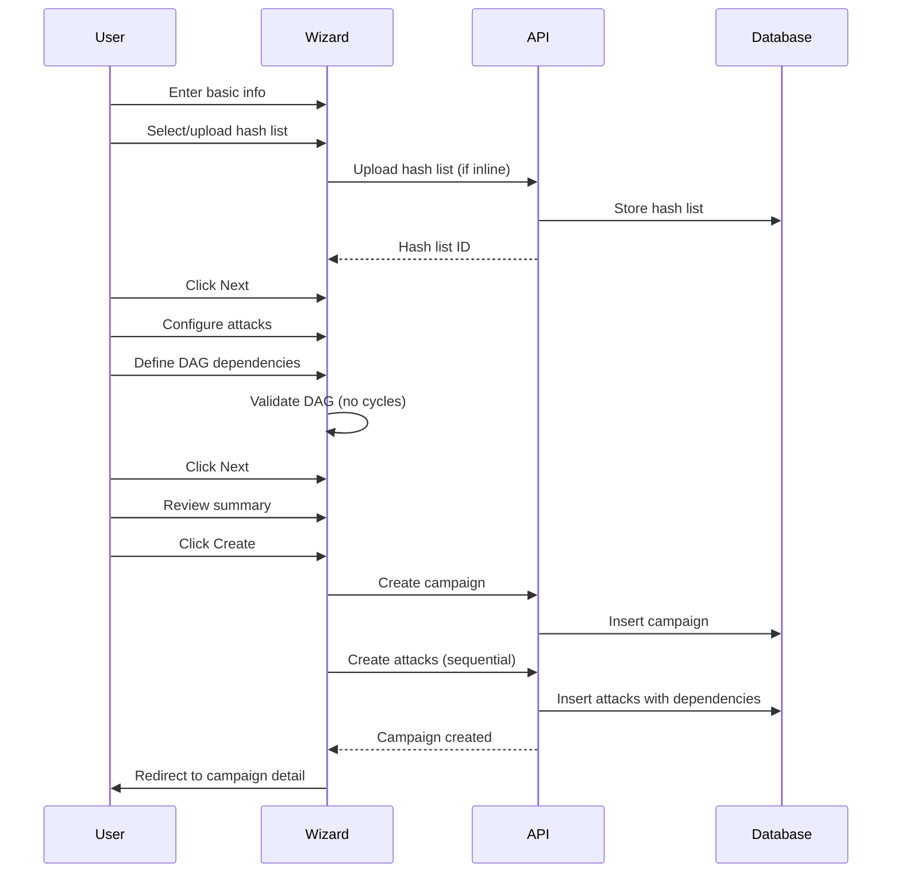

# Core Flows: HashHive User Journeys

## Overview

This document defines the core user flows for HashHive, covering the complete journey from login through campaign execution and result analysis. These flows serve three primary user roles: Security Professionals (red team operators), Infrastructure Administrators, and Analysts.

## Roles & Permissions

- **Admin**: Global administrator — full access across all projects (manage users, projects, campaigns, resources, results).
- **Power-user**: Project-level administrator — full access within assigned projects (manage campaigns, resources, project membership).
- **User**: Standard user — can create and use own campaigns and resources, view results (cannot alter other users' resources within the project).

---

## Flow 1: Login & Project Selection

**Description:** User authenticates and selects a project to work within.

**Trigger:** User navigates to HashHive URL or clicks logout → login.

**Steps:**

1. User lands on login page
2. User enters email and password
3. User clicks "Login" button
4. System validates credentials and creates session
5. IF the user has exactly one project, the system auto-selects it
6. IF the user has multiple projects, the system redirects to a project selector and the user selects one
7. System redirects to Dashboard with project context active
8. Sidebar shows selected project name with option to switch projects

**UI Feedback:**

- Login button shows loading state during authentication
- Invalid credentials show error message below form
- Project selector shows user's role for each project (admin, operator, analyst)
- Selected project persists across page navigation

---

## Flow 2: Dashboard Monitoring

**Description:** User monitors overall system health and activity at a glance.

**Trigger:** User selects a project or clicks "Dashboard" in navigation.

**Steps:**

1. User lands on Dashboard page
2. System displays four stat cards: Agents (online/total), Active Campaigns, Running Tasks, Total Cracked Hashes
3. Connection indicator in top-right shows WebSocket status (green dot = connected)
4. Stats update in real-time as events occur (agent status changes, tasks complete, hashes crack)
5. User can click on any stat card to navigate to relevant detail page (e.g., Agents card → Agent list)

**UI Feedback:**

- Loading skeleton shown while stats load
- Connection indicator reflects connected/disconnected state; when disconnected, the UI falls back to periodic polling (slower updates)
- Stats update silently without page refresh
- Empty state message if no project selected

---

## Flow 3: Campaign Creation

**Description:** Operator creates a new password cracking campaign with multiple attacks.

**Trigger:** User clicks "Create Campaign" button from Campaign list or Dashboard.

**Steps:**

**Step 1: Basic Info**

1. User sees 3-step wizard with progress indicator (Basic Info → Attacks → Review)
2. User enters campaign name (required)
3. User enters description (optional)
4. User sets priority (1-10 slider or number input)
5. User selects hash list from dropdown OR clicks "Upload New" to upload inline
  - If uploading inline: file picker opens, user selects file, upload progress shown, hash list added to dropdown
6. User clicks "Next: Configure Attacks"
7. System validates form and advances to Step 2

**Step 2: Attacks**
8. User sees attack configuration form with visual DAG editor below
9. User selects hashcat mode from dropdown
10. User optionally selects wordlist, rulelist, or masklist (or uploads new inline)
11. User clicks "Add Attack" button
12. Attack appears in DAG editor as a node
13. User repeats steps 9-12 to add more attacks
14. User drags connections between attack nodes to define dependencies
15. System validates DAG for cycles and shows error if circular dependency detected
16. User can remove attacks by clicking delete icon on node
17. User clicks "Next: Review"
18. System validates at least one attack exists and advances to Step 3

**Step 3: Review & Submit**
19. User sees campaign summary card with all configured details
20. User sees attack count and DAG preview
21. User clicks "Back" to edit or "Create Campaign" to submit
22. System creates campaign and all attacks
23. System redirects to campaign detail page
24. Success message shown: "Campaign created successfully"

**UI Feedback:**

- Form validation errors shown inline below fields
- Step indicator shows current step and allows clicking previous steps
- DAG editor highlights invalid connections in red
- "Create Campaign" button shows loading state during submission
- Error message shown if creation fails



---

## Flow 4: Campaign Management

**Description:** Operator views, monitors, and controls campaign execution.

**Trigger:** User clicks "Campaigns" in navigation or clicks campaign from Dashboard.

### 4a: Campaign List

**Steps:**

1. User sees table of campaigns with columns: Name, Status, Progress, Priority, Created
2. User can filter by status (draft, running, paused, completed, failed)
3. User can sort by any column
4. Each row shows quick action buttons: Start (if draft/paused), Pause (if running), Stop (if running)
5. User clicks a quick action button:
  - **Start**: opens a confirmation modal
  - **Pause / Stop**: applies immediately
6. IF Start: user confirms, then the system starts the campaign
7. System updates status and shows confirmation toast
8. User clicks campaign name to view detail

**UI Feedback:**

- Status shown as colored badge (draft=gray, running=blue, paused=yellow, completed=green, failed=red)
- Progress shown as percentage with progress bar
- Quick action buttons disabled if action not valid for current status
- Real-time updates: new campaigns appear, status changes reflect immediately

### 4b: Campaign Detail

**Steps:**

1. User sees campaign header with name, status badge, and action buttons (Start/Pause/Stop)
2. User sees three primary sections:
  - **Progress Panel** (top): Completion percentage, ETA, hash rate, cracked count
  - **DAG Visualization** (middle): Visual graph showing attack dependencies with status colors
  - **Agent & Task Distribution** (bottom): Table showing which agents are working on which tasks
3. User can click on attack node in DAG to see attack details
4. User can click "View Results" button to see cracked passwords for this campaign
5. User clicks Start/Pause/Stop button:
  - **Start** (one-click from detail): starts the campaign
  - **Pause**: pauses execution
  - **Stop**: cancels current tasks and returns the campaign to Draft (can be restarted)
6. System updates campaign status and redistributes/cancels tasks as needed

**UI Feedback:**

- Progress panel updates in real-time as tasks complete
- DAG nodes colored by attack status (pending=gray, running=blue, completed=green, failed=red)
- Agent table shows live task assignments
- Action buttons show loading state during status change
- Confirmation toast shown after status change

---

## Flow 5: Agent Monitoring

**Description:** User monitors agent health and utilization across the fleet.

**Trigger:** User clicks "Agents" in navigation.

**Cross-project visibility:** All users can see every agent's status and hardware profile. When an agent is working on a task from a project the user doesn't have access to, only the project name is shown — task, attack, and campaign names/descriptions are redacted. Admins see full details for all agents across all projects.

### 5a: Agent List

**Steps:**

1. User sees table of agents with columns: Name, Status, Last Seen, Actions
2. User can filter by status (online, offline, busy, error)
3. Agents with errors show error badge (red dot with count)
4. User clicks "Details" link to view agent detail
5. Status updates in real-time via WebSocket

**UI Feedback:**

- Status shown as colored badge with icon
- Last Seen shows relative time ("2 minutes ago")
- Error badge shows error count in red
- Empty state if no agents registered

### 5b: Agent Detail

**Steps:**

1. User sees agent header with name, status, and last seen timestamp
2. User sees hardware profile: OS, GPU models, CPU specs, hashcat version
3. User sees current task assignment:
   - If the task belongs to a project the user has access to: full details shown (task ID, campaign name, attack name) with link to campaign
   - If the task belongs to a different project: project name shown, task/campaign/attack details redacted (e.g., "Busy — Project: Lab Sandbox")
   - Admins always see full details
4. User sees error log table with columns: Timestamp, Severity, Message, Task
5. User can filter errors by severity (warning, error, fatal)
6. User can click task link to navigate to campaign detail (only if user has access to that project)

**UI Feedback:**

- Hardware profile shown as key-value pairs
- Error log sorted by timestamp (newest first)
- Severity shown as colored badge
- Redacted task assignments shown with muted styling to indicate limited visibility
- Empty state if no errors logged

---

## Flow 6: Resource Management

**Description:** User uploads and manages reusable resources (hash lists, wordlists, rulelists, masklists).

**Trigger:** User clicks "Resources" in navigation.

**Steps:**

1. User sees tabbed interface: Hash Lists | Wordlists | Rulelists | Masklists | Hash Detect
2. User clicks tab to switch resource type
3. User sees table of resources with columns: Name, Created (+ type-specific columns)
4. User clicks "Upload" button
5. File picker opens
6. User selects file from filesystem
7. Upload modal shows with name field (pre-filled from filename) and optional metadata
8. User clicks "Upload" button in modal
9. System uploads file to storage and creates resource record
10. Progress bar shown during upload
11. Resource appears in table after successful upload
12. Success toast shown: "Resource uploaded successfully"

**UI Feedback:**

- Upload button prominent at top of each tab
- Upload progress shown as percentage
- Error message if upload fails (file too large, invalid format, etc.)
- Hash Lists tab shows additional columns: Hash Count, Cracked Count
- Empty state with "Upload your first [resource type]" message

---

## Flow 7: Hash Type Detection

**Description:** User identifies hash type for unknown hashes.

**Trigger:** User clicks "Hash Detect" tab in Resources page.

**Steps:**

1. User sees input field with placeholder "Enter a hash value..."
2. User pastes or types hash value
3. User presses Enter or clicks "Detect Type" button
4. System analyzes hash and returns candidate types with confidence scores
5. User sees results table with columns: Type, Hashcat Mode, Category, Confidence
6. Confidence shown as progress bar (0-100%)
7. Results sorted by confidence (highest first)
8. User can copy hashcat mode number for use in campaign creation

**UI Feedback:**

- Detect button shows loading state during analysis
- Results appear below input field
- Empty state if no matches found: "No matching hash types found"
- Confidence bar colored green (high), yellow (medium), red (low)

---

## Flow 8: Result Analysis

**Description:** Analyst reviews cracked passwords across multiple views.

**Trigger:** User wants to see cracked passwords.

### 8a: Results Page (Dedicated View)

**Steps:**

1. User clicks "Results" in navigation
2. User sees table of all cracked hashes across all campaigns
3. Columns: Hash Value, Plaintext, Campaign, Attack Method, Cracked At
4. User can filter by campaign, attack method, or date range
5. User can search by hash value or plaintext
6. User can export results as CSV
7. User clicks campaign name to navigate to campaign detail

**UI Feedback:**

- Plaintext shown in monospace font
- Export button downloads CSV file
- Pagination if many results
- Real-time updates: new cracks appear automatically

### 8b: Campaign Results Tab

**Steps:**

1. User on campaign detail page clicks "Results" tab
2. User sees table of cracked hashes for this campaign only
3. Same columns as Results page but filtered to campaign
4. User can filter by attack method within campaign

### 8c: Hash List Detail

**Steps:**

1. User clicks hash list name from Resources page
2. User sees hash list detail with statistics
3. User sees table of all hashes in list with columns: Hash Value, Plaintext, Status, Cracked At
4. Status badge shows: Cracked (green) or Pending (gray)
5. User can see which campaign cracked each hash

**UI Feedback:**

- Statistics panel shows: Total Hashes, Cracked Count, Crack Rate %
- Progress bar shows crack rate visually
- Cracked hashes highlighted in green
- Link to campaign that cracked each hash

---

## Navigation & Layout

**Global Navigation:**

- Sidebar with links: Dashboard, Campaigns, Agents, Resources, Results
- Project selector dropdown in sidebar header
- User menu in top-right: Profile, Settings, Logout
- Connection indicator in top-right (green dot = connected, gray = disconnected)

**Breadcrumbs:**

- Shown on detail pages: Campaign List > Campaign Name
- Clickable to navigate back

**Real-Time Updates:**

- Connection indicator always visible; if disconnected, the UI automatically falls back to polling
- Updates happen silently without user action
- No toast notifications for routine updates (only for user actions)

---

## Wireframes (Key Screens)

```wireframe
<!DOCTYPE html>
<html>
<head>
  <meta charset="utf-8" />
  <style>
    body { font-family: sans-serif; margin: 0; }
    .app { display: flex; min-height: 100vh; }
    .sidebar { width: 220px; border-right: 1px solid #ccc; padding: 12px; }
    .main { flex: 1; padding: 16px; }
    .nav a { display: block; padding: 6px 0; color: #111; text-decoration: none; }
    .topbar { display: flex; justify-content: space-between; align-items: center; border-bottom: 1px solid #eee; padding-bottom: 10px; margin-bottom: 12px; }
    .card { border: 1px solid #ccc; padding: 12px; border-radius: 6px; }
    .grid { display: grid; grid-template-columns: repeat(4, 1fr); gap: 10px; }
    .pill { display: inline-block; padding: 2px 8px; border: 1px solid #ccc; border-radius: 999px; font-size: 12px; }
    .btn { border: 1px solid #333; padding: 6px 10px; border-radius: 6px; background: #fff; }
    .row { display: flex; gap: 10px; align-items: center; }
    .table { width: 100%; border-collapse: collapse; }
    .table th, .table td { border-bottom: 1px solid #eee; padding: 8px; text-align: left; font-size: 13px; }
    .muted { color: #666; font-size: 12px; }
    .input { border: 1px solid #ccc; padding: 6px 8px; border-radius: 6px; width: 100%; }
    .tabs { display: flex; gap: 10px; border-bottom: 1px solid #eee; margin-bottom: 10px; }
    .tab { padding: 8px 10px; border: 1px solid #eee; border-bottom: none; border-radius: 6px 6px 0 0; background: #fafafa; }
  </style>
</head>
<body>
  <div class="app">
    <aside class="sidebar">
      <div class="card">
        <div class="muted">Project</div>
        <button class="btn" data-element-id="project-switch">Acme Red Team ▾</button>
      </div>
      <div style="height: 12px"></div>
      <nav class="nav">
        <a href="#" data-element-id="nav-dashboard">Dashboard</a>
        <a href="#" data-element-id="nav-campaigns">Campaigns</a>
        <a href="#" data-element-id="nav-agents">Agents</a>
        <a href="#" data-element-id="nav-resources">Resources</a>
        <a href="#" data-element-id="nav-results">Results</a>
      </nav>
    </aside>
    <main class="main">
      <div class="topbar">
        <h2 style="margin:0">(Wireframe Collection)</h2>
        <div class="row">
          <span class="pill" data-element-id="connection-indicator">Connected</span>
          <button class="btn" data-element-id="user-menu">User ▾</button>
        </div>
      </div>
      <div class="card">
        This block contains multiple screen wireframes below.
      </div>
    </main>
  </div>
</body>
</html>
```

### Project Selector

```wireframe
<!DOCTYPE html>
<html>
<head>
  <meta charset="utf-8" />
  <style>
    body { font-family: sans-serif; margin: 0; padding: 18px; }
    .card { border: 1px solid #ccc; border-radius: 6px; padding: 14px; max-width: 720px; }
    .projects { margin-top: 10px; display: grid; gap: 10px; }
    .proj { border: 1px solid #eee; padding: 10px; border-radius: 6px; display: flex; justify-content: space-between; }
    .btn { border: 1px solid #333; padding: 6px 10px; border-radius: 6px; background: #fff; }
    .pill { border: 1px solid #ccc; border-radius: 999px; padding: 2px 8px; font-size: 12px; }
    .muted { color: #666; font-size: 12px; }
  </style>
</head>
<body>
  <h2 style="margin-top:0">Select a Project</h2>
  <div class="card">
    <div class="muted">Choose where you want to work.</div>
    <div class="projects">
      <div class="proj">
        <div>
          <div><strong>Acme Red Team</strong></div>
          <div class="muted">Private lab operations</div>
        </div>
        <div style="display:flex; gap:8px; align-items:center;">
          <span class="pill">Operator</span>
          <button class="btn" data-element-id="select-project-1">Select</button>
        </div>
      </div>
      <div class="proj">
        <div>
          <div><strong>Lab Sandbox</strong></div>
          <div class="muted">Testing and experiments</div>
        </div>
        <div style="display:flex; gap:8px; align-items:center;">
          <span class="pill">Admin</span>
          <button class="btn" data-element-id="select-project-2">Select</button>
        </div>
      </div>
    </div>
  </div>
</body>
</html>
```

### Dashboard

```wireframe
<!DOCTYPE html>
<html>
<head>
  <meta charset="utf-8" />
  <style>
    body { font-family: sans-serif; margin: 0; padding: 18px; }
    .grid { display: grid; grid-template-columns: repeat(4, 1fr); gap: 10px; }
    .card { border: 1px solid #ccc; border-radius: 6px; padding: 12px; }
    .muted { color: #666; font-size: 12px; }
    .btn { border: 1px solid #333; padding: 6px 10px; border-radius: 6px; background: #fff; }
    .row { display:flex; justify-content: space-between; align-items:center; }
  </style>
</head>
<body>
  <div class="row">
    <h2 style="margin:0">Dashboard</h2>
    <div class="row" style="gap:10px;">
      <span class="muted">Connection:</span>
      <span data-element-id="connection-indicator">Connected</span>
      <button class="btn" data-element-id="switch-project">Project ▾</button>
    </div>
  </div>
  <div style="height:12px"></div>
  <div class="grid">
    <div class="card" data-element-id="stat-agents"><div class="muted">Agents</div><div style="font-size:20px">3 / 5</div><div class="muted">Online</div></div>
    <div class="card" data-element-id="stat-campaigns"><div class="muted">Campaigns</div><div style="font-size:20px">2</div><div class="muted">Active</div></div>
    <div class="card" data-element-id="stat-tasks"><div class="muted">Tasks</div><div style="font-size:20px">14</div><div class="muted">Running</div></div>
    <div class="card" data-element-id="stat-cracked"><div class="muted">Cracked</div><div style="font-size:20px">128</div><div class="muted">Total hashes</div></div>
  </div>
</body>
</html>
```

### Campaign List

```wireframe
<!DOCTYPE html>
<html>
<head>
  <meta charset="utf-8" />
  <style>
    body { font-family: sans-serif; margin: 0; padding: 18px; }
    .row { display:flex; justify-content: space-between; align-items:center; gap:10px; }
    .btn { border: 1px solid #333; padding: 6px 10px; border-radius: 6px; background: #fff; }
    .table { width: 100%; border-collapse: collapse; margin-top: 10px; }
    .table th, .table td { border-bottom: 1px solid #eee; padding: 8px; text-align:left; font-size: 13px; }
    .pill { border: 1px solid #ccc; border-radius: 999px; padding: 2px 8px; font-size: 12px; }
    .input { border: 1px solid #ccc; padding: 6px 8px; border-radius: 6px; }
  </style>
</head>
<body>
  <div class="row">
    <h2 style="margin:0">Campaigns</h2>
    <div class="row">
      <select class="input" data-element-id="campaign-status-filter">
        <option>All Statuses</option>
        <option>Draft</option>
        <option>Running</option>
        <option>Paused</option>
        <option>Completed</option>
      </select>
      <button class="btn" data-element-id="create-campaign">Create Campaign</button>
    </div>
  </div>
  <table class="table">
    <thead>
      <tr><th>Name</th><th>Status</th><th>Progress</th><th>Priority</th><th>Actions</th></tr>
    </thead>
    <tbody>
      <tr>
        <td><a href="#" data-element-id="campaign-1">VPN Audit</a></td>
        <td><span class="pill">Draft</span></td>
        <td>—</td>
        <td>7</td>
        <td>
          <button class="btn" data-element-id="campaign-1-start">Start</button>
          <button class="btn" data-element-id="campaign-1-stop">Stop</button>
        </td>
      </tr>
      <tr>
        <td><a href="#" data-element-id="campaign-2">Corp Hash Dump</a></td>
        <td><span class="pill">Running</span></td>
        <td>42%</td>
        <td>9</td>
        <td>
          <button class="btn" data-element-id="campaign-2-pause">Pause</button>
          <button class="btn" data-element-id="campaign-2-stop">Stop</button>
        </td>
      </tr>
    </tbody>
  </table>
</body>
</html>
```

### Campaign Detail

```wireframe
<!DOCTYPE html>
<html>
<head>
  <meta charset="utf-8" />
  <style>
    body { font-family: sans-serif; margin: 0; padding: 18px; }
    .row { display:flex; justify-content: space-between; align-items:center; gap:10px; }
    .btn { border: 1px solid #333; padding: 6px 10px; border-radius: 6px; background: #fff; }
    .grid { display:grid; grid-template-columns: 1fr; gap: 10px; margin-top: 10px; }
    .card { border: 1px solid #ccc; border-radius: 6px; padding: 12px; }
    .muted { color: #666; font-size: 12px; }
    .table { width: 100%; border-collapse: collapse; }
    .table th, .table td { border-bottom: 1px solid #eee; padding: 8px; text-align:left; font-size: 13px; }
  </style>
</head>
<body>
  <div class="row">
    <div>
      <div class="muted">Campaign</div>
      <h2 style="margin:0">Corp Hash Dump</h2>
      <div class="muted">Status: Running • ETA: 3h 12m</div>
    </div>
    <div class="row">
      <button class="btn" data-element-id="campaign-start">Start</button>
      <button class="btn" data-element-id="campaign-pause">Pause</button>
      <button class="btn" data-element-id="campaign-stop">Stop</button>
      <button class="btn" data-element-id="campaign-view-results">View Results</button>
    </div>
  </div>

  <div class="grid">
    <div class="card" data-element-id="campaign-progress">
      <div class="muted">Progress</div>
      <div style="font-size:20px">42% complete</div>
      <div class="muted">Hash rate: 12.4 GH/s • Cracked: 128</div>
    </div>

    <div class="card" data-element-id="campaign-dag">
      <div class="muted">Attack DAG</div>
      <div style="height:120px; border:1px dashed #ccc; border-radius:6px; display:flex; align-items:center; justify-content:center;">Graph canvas placeholder</div>
    </div>

    <div class="card" data-element-id="campaign-agent-tasks">
      <div class="muted">Agents & Task Distribution</div>
      <table class="table">
        <thead><tr><th>Agent</th><th>Status</th><th>Task</th><th>Progress</th></tr></thead>
        <tbody>
          <tr><td>rig-01</td><td>Busy</td><td>#1442</td><td>18%</td></tr>
          <tr><td>rig-02</td><td>Busy</td><td>#1443</td><td>21%</td></tr>
        </tbody>
      </table>
    </div>
  </div>
</body>
</html>
```

### Campaign Wizard (3 Steps)

```wireframe
<!DOCTYPE html>
<html>
<head>
  <meta charset="utf-8" />
  <style>
    body { font-family: sans-serif; margin: 0; padding: 18px; }
    .steps { display:flex; gap:8px; margin-bottom: 12px; }
    .step { border: 1px solid #ccc; border-radius: 999px; padding: 4px 10px; font-size: 12px; }
    .card { border: 1px solid #ccc; border-radius: 6px; padding: 12px; }
    .row { display:flex; gap:10px; align-items:center; }
    .btn { border: 1px solid #333; padding: 6px 10px; border-radius: 6px; background:#fff; }
    .input { border: 1px solid #ccc; padding: 6px 8px; border-radius: 6px; width: 100%; }
    .muted { color:#666; font-size: 12px; }
  </style>
</head>
<body>
  <h2 style="margin-top:0">Create Campaign</h2>
  <div class="steps">
    <div class="step" data-element-id="step-basic">1. Basic Info</div>
    <div class="step" data-element-id="step-attacks">2. Attacks</div>
    <div class="step" data-element-id="step-review">3. Review</div>
  </div>

  <div class="card" data-element-id="wizard-basic">
    <div class="muted">Basic Info</div>
    <div style="height:8px"></div>
    <div class="row">
      <div style="flex:1">
        <div class="muted">Campaign Name</div>
        <input class="input" data-element-id="campaign-name" />
      </div>
      <div style="width:140px">
        <div class="muted">Priority</div>
        <input class="input" data-element-id="campaign-priority" />
      </div>
    </div>
    <div style="height:8px"></div>
    <div class="row">
      <div style="flex:1">
        <div class="muted">Hash List</div>
        <select class="input" data-element-id="hashlist-select"><option>Select…</option></select>
      </div>
      <button class="btn" data-element-id="hashlist-upload-inline">Upload New</button>
    </div>
    <div style="height:10px"></div>
    <button class="btn" data-element-id="wizard-next">Next</button>
  </div>
</body>
</html>
```

### Agent List

```wireframe
<!DOCTYPE html>
<html>
<head>
  <meta charset="utf-8" />
  <style>
    body { font-family: sans-serif; margin: 0; padding: 18px; }
    .row { display:flex; justify-content: space-between; align-items:center; gap:10px; }
    .btn { border: 1px solid #333; padding: 6px 10px; border-radius: 6px; background: #fff; }
    .input { border: 1px solid #ccc; padding: 6px 8px; border-radius: 6px; }
    .table { width: 100%; border-collapse: collapse; margin-top: 10px; }
    .table th, .table td { border-bottom: 1px solid #eee; padding: 8px; text-align:left; font-size: 13px; }
    .pill { border: 1px solid #ccc; border-radius: 999px; padding: 2px 8px; font-size: 12px; }
  </style>
</head>
<body>
  <div class="row">
    <h2 style="margin:0">Agents</h2>
    <select class="input" data-element-id="agent-status-filter">
      <option>All Statuses</option>
      <option>Online</option>
      <option>Offline</option>
      <option>Error</option>
    </select>
  </div>
  <table class="table">
    <thead><tr><th>Name</th><th>Status</th><th>Last Seen</th><th>Errors</th><th></th></tr></thead>
    <tbody>
      <tr>
        <td>rig-01</td>
        <td><span class="pill">Online</span></td>
        <td>2m ago</td>
        <td><span class="pill">0</span></td>
        <td><button class="btn" data-element-id="agent-1-details">Details</button></td>
      </tr>
      <tr>
        <td>rig-02</td>
        <td><span class="pill">Error</span></td>
        <td>Just now</td>
        <td><span class="pill">3</span></td>
        <td><button class="btn" data-element-id="agent-2-details">Details</button></td>
      </tr>
    </tbody>
  </table>
</body>
</html>
```

### Agent Detail (with Error Log)

```wireframe
<!DOCTYPE html>
<html>
<head>
  <meta charset="utf-8" />
  <style>
    body { font-family: sans-serif; margin: 0; padding: 18px; }
    .card { border: 1px solid #ccc; border-radius: 6px; padding: 12px; margin-top: 10px; }
    .muted { color:#666; font-size: 12px; }
    .table { width: 100%; border-collapse: collapse; }
    .table th, .table td { border-bottom: 1px solid #eee; padding: 8px; text-align:left; font-size: 13px; }
    .pill { border: 1px solid #ccc; border-radius: 999px; padding: 2px 8px; font-size: 12px; }
  </style>
</head>
<body>
  <h2 style="margin-top:0">Agent: rig-02</h2>
  <div class="muted">Status: Error • Last seen: just now</div>

  <div class="card" data-element-id="agent-hardware">
    <div class="muted">Hardware Profile</div>
    <div>OS: Linux • GPUs: 2x RTX • Hashcat: 6.x</div>
  </div>

  <div class="card" data-element-id="agent-errors">
    <div class="muted">Error Log</div>
    <table class="table">
      <thead><tr><th>Time</th><th>Severity</th><th>Message</th><th>Task</th></tr></thead>
      <tbody>
        <tr><td>10:42</td><td><span class="pill">error</span></td><td>Temp throttle</td><td><a href="#" data-element-id="task-link-1">#1443</a></td></tr>
        <tr><td>10:40</td><td><span class="pill">warning</span></td><td>Driver reset</td><td>—</td></tr>
      </tbody>
    </table>
  </div>
</body>
</html>
```

### Resources (Tabbed)

```wireframe
<!DOCTYPE html>
<html>
<head>
  <meta charset="utf-8" />
  <style>
    body { font-family: sans-serif; margin: 0; padding: 18px; }
    .row { display:flex; justify-content: space-between; align-items:center; gap:10px; }
    .tabs { display:flex; gap:8px; border-bottom: 1px solid #eee; margin: 10px 0; }
    .tab { padding: 8px 10px; border: 1px solid #eee; border-bottom: none; border-radius: 6px 6px 0 0; background:#fafafa; }
    .btn { border: 1px solid #333; padding: 6px 10px; border-radius: 6px; background:#fff; }
    .table { width: 100%; border-collapse: collapse; }
    .table th, .table td { border-bottom: 1px solid #eee; padding: 8px; text-align:left; font-size: 13px; }
  </style>
</head>
<body>
  <div class="row">
    <h2 style="margin:0">Resources</h2>
    <button class="btn" data-element-id="resource-upload">Upload</button>
  </div>

  <div class="tabs">
    <div class="tab" data-element-id="tab-hashlists">Hash Lists</div>
    <div class="tab" data-element-id="tab-wordlists">Wordlists</div>
    <div class="tab" data-element-id="tab-rulelists">Rulelists</div>
    <div class="tab" data-element-id="tab-masklists">Masklists</div>
    <div class="tab" data-element-id="tab-detect">Hash Detect</div>
  </div>

  <table class="table">
    <thead><tr><th>Name</th><th>Created</th></tr></thead>
    <tbody>
      <tr><td>corp_hashes.txt</td><td>2026-02-10</td></tr>
      <tr><td>rockyou.txt</td><td>2026-02-01</td></tr>
    </tbody>
  </table>
</body>
</html>
```

### Results (with Export)

```wireframe
<!DOCTYPE html>
<html>
<head>
  <meta charset="utf-8" />
  <style>
    body { font-family: sans-serif; margin: 0; padding: 18px; }
    .row { display:flex; justify-content: space-between; align-items:center; gap:10px; }
    .btn { border: 1px solid #333; padding: 6px 10px; border-radius: 6px; background:#fff; }
    .input { border: 1px solid #ccc; padding: 6px 8px; border-radius: 6px; }
    .table { width: 100%; border-collapse: collapse; margin-top: 10px; }
    .table th, .table td { border-bottom: 1px solid #eee; padding: 8px; text-align:left; font-size: 13px; }
    .muted { color:#666; font-size: 12px; }
  </style>
</head>
<body>
  <div class="row">
    <h2 style="margin:0">Results</h2>
    <div class="row">
      <input class="input" placeholder="Search…" data-element-id="results-search" />
      <button class="btn" data-element-id="results-export-csv">Export CSV</button>
    </div>
  </div>
  <div class="muted" style="margin-top:8px">Filters: campaign, attack method, date range</div>
  <table class="table">
    <thead><tr><th>Hash</th><th>Plaintext</th><th>Campaign</th><th>Attack</th><th>Cracked At</th></tr></thead>
    <tbody>
      <tr><td>…</td><td><code>Winter2024!</code></td><td><a href="#" data-element-id="results-campaign-link">Corp Hash Dump</a></td><td>Rules</td><td>10:41</td></tr>
      <tr><td>…</td><td><code>Password1</code></td><td>VPN Audit</td><td>Dict</td><td>09:12</td></tr>
    </tbody>
  </table>
</body>
</html>
```

&nbsp;
