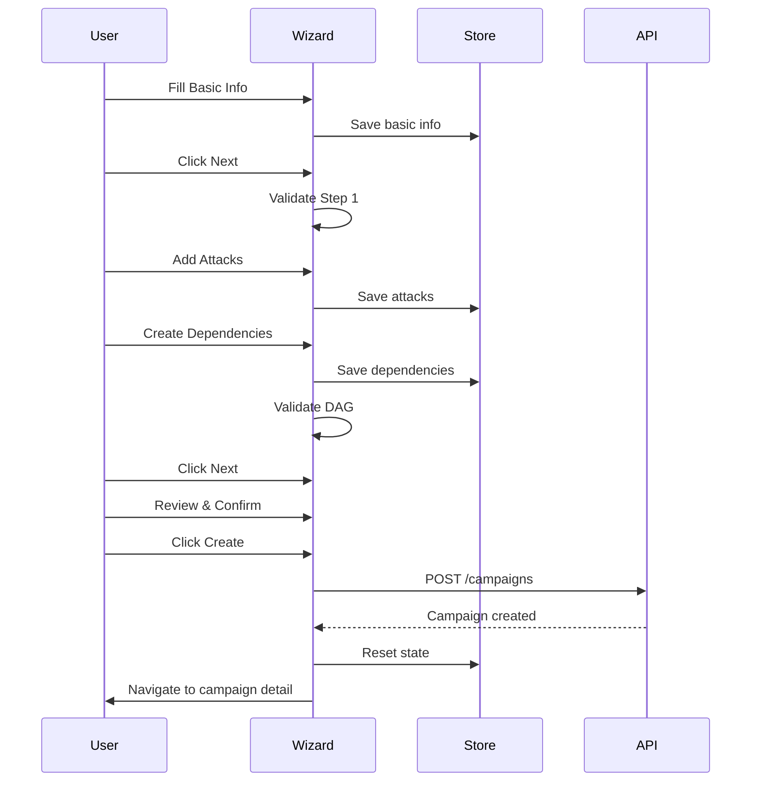

# Campaign Creation Wizard UI

## Overview

Implement 3-step campaign creation wizard with visual DAG editor, inline resource upload, and frontend DAG validation.

## Scope

**In Scope:**
- Implement 3-step wizard (Basic Info → Attacks → Review)
- Add visual DAG editor for attack dependencies (drag-and-drop graph)
- Implement frontend DAG validation (cycle detection, immediate feedback)
- Add inline resource upload option in wizard
- Add attack configuration forms (hashcat mode, wordlist, rulelist, masklist selection)
- Implement wizard state management with Zustand
- Add navigation to campaign detail page after creation
- Create `file:packages/frontend/src/pages/campaign-create.tsx` and `file:packages/frontend/src/stores/campaign-wizard.ts`

**Out of Scope:**
- Campaign templates
- Attack presets
- Advanced scheduling

## Acceptance Criteria

1. **Step 1: Basic Info**
   - Form fields: Name (required), Description (optional), Hash List (dropdown), Priority (high/normal/low)
   - Hash List dropdown shows available hash lists
   - "Upload New Hash List" button opens inline upload modal
   - "Next" button validates form and proceeds to Step 2
   - Form state persisted in Zustand store

2. **Step 2: Attacks Configuration**
   - "Add Attack" button opens attack configuration form
   - Attack form fields:
     - Attack Mode (dropdown: dictionary, combinator, brute-force, hybrid, mask)
     - Hash Type (dropdown, pre-filled from hash list if detected)
     - Wordlist (dropdown or inline upload)
     - Rulelist (dropdown or inline upload, optional)
     - Masklist (dropdown or inline upload, optional for mask attacks)
     - Advanced Configuration (textarea for hashcat flags, optional)
   - Attack list shows added attacks with edit/delete actions
   - Visual DAG editor shows attack dependencies
   - Drag attack nodes to reposition
   - Click and drag between nodes to create dependency edge
   - Frontend validates DAG for cycles (shows error if cycle detected)
   - "Next" button validates attacks and proceeds to Step 3

3. **Step 3: Review**
   - Summary of campaign configuration:
     - Basic info (name, description, hash list, priority)
     - Attack list with dependencies
     - DAG visualization (read-only)
   - "Create Campaign" button calls API
   - On success, navigates to campaign detail page
   - On error, shows error message and allows editing

4. **Visual DAG Editor**
   - Nodes represent attacks (labeled with attack mode)
   - Edges represent dependencies (arrows point from dependency to dependent)
   - Drag nodes to reposition
   - Click node to edit attack configuration
   - Click edge to delete dependency
   - Right-click node to delete attack
   - Validation runs on every change (cycle detection)
   - Error message displayed if cycle detected

5. **Frontend DAG Validation**
   - Topological sort algorithm detects cycles
   - Validation runs on every DAG change
   - Error message shows which attacks form the cycle
   - "Next" button disabled if cycle exists
   - Validation matches backend logic (same algorithm)

6. **Inline Resource Upload**
   - "Upload New" button in resource dropdowns opens modal
   - Modal contains file upload component
   - Upload triggers API call
   - On success, new resource added to dropdown and auto-selected
   - Modal closes automatically

7. **Wizard State Management**
   - Zustand store persists wizard state across steps
   - "Back" button navigates to previous step without losing data
   - "Cancel" button shows confirmation modal and clears state
   - State cleared after successful campaign creation

## Technical Notes

**Wizard Store (Zustand):**
```typescript
interface CampaignWizardState {
  step: 1 | 2 | 3;
  basicInfo: { name: string; description?: string; hashListId: number; priority: string };
  attacks: Attack[];
  setStep: (step: number) => void;
  setBasicInfo: (info: BasicInfo) => void;
  addAttack: (attack: Attack) => void;
  updateAttack: (id: string, attack: Attack) => void;
  deleteAttack: (id: string) => void;
  addDependency: (fromId: string, toId: string) => void;
  removeDependency: (fromId: string, toId: string) => void;
  reset: () => void;
}
```

**DAG Validation (Frontend):**
```typescript
function validateDAG(attacks: Attack[]): { valid: boolean; cycle?: string[] } {
  const graph = new Map<string, string[]>();
  attacks.forEach(a => graph.set(a.id, a.dependencies));

  // Topological sort (same algorithm as backend)
  const inDegree = new Map<string, number>();
  attacks.forEach(a => inDegree.set(a.id, 0));

  attacks.forEach(a => {
    a.dependencies.forEach(depId => {
      inDegree.set(depId, (inDegree.get(depId) || 0) + 1);
    });
  });

  const queue = attacks.filter(a => inDegree.get(a.id) === 0);
  let processed = 0;

  while (queue.length > 0) {
    const current = queue.shift()!;
    processed++;

    current.dependencies.forEach(depId => {
      inDegree.set(depId, inDegree.get(depId)! - 1);
      if (inDegree.get(depId) === 0) {
        queue.push(attacks.find(a => a.id === depId)!);
      }
    });
  }

  if (processed !== attacks.length) {
    // Find cycle
    const cycle = attacks.filter(a => inDegree.get(a.id)! > 0).map(a => a.id);
    return { valid: false, cycle };
  }

  return { valid: true };
}
```

**Visual DAG Editor:**
- Use react-flow library for graph visualization
- Custom node component for attack nodes
- Custom edge component for dependency edges
- Handle node drag, edge creation, edge deletion
- Sync graph state with Zustand store

**Wizard Flow:**


## Dependencies

- `ticket:f4542d0d-b9bd-4e50-b90b-9141e8063a18/T8` (Resource Management API)
- `ticket:f4542d0d-b9bd-4e50-b90b-9141e8063a18/T9` (Campaign Orchestration API)
- `ticket:f4542d0d-b9bd-4e50-b90b-9141e8063a18/T3` (Real-Time Events)

## Spec References

- `spec:f4542d0d-b9bd-4e50-b90b-9141e8063a18/98662419-66d0-40ee-a788-e5aa8c4c4de5` (Core Flows → Flow 3: Campaign Creation)
- `spec:f4542d0d-b9bd-4e50-b90b-9141e8063a18/98662419-66d0-40ee-a788-e5aa8c4c4de5` (Core Flows → Wireframes: Campaign Wizard)
- `spec:f4542d0d-b9bd-4e50-b90b-9141e8063a18/9332598a-b507-42ee-8e71-6a8e43712c16` (Tech Plan → DAG validation decision)
