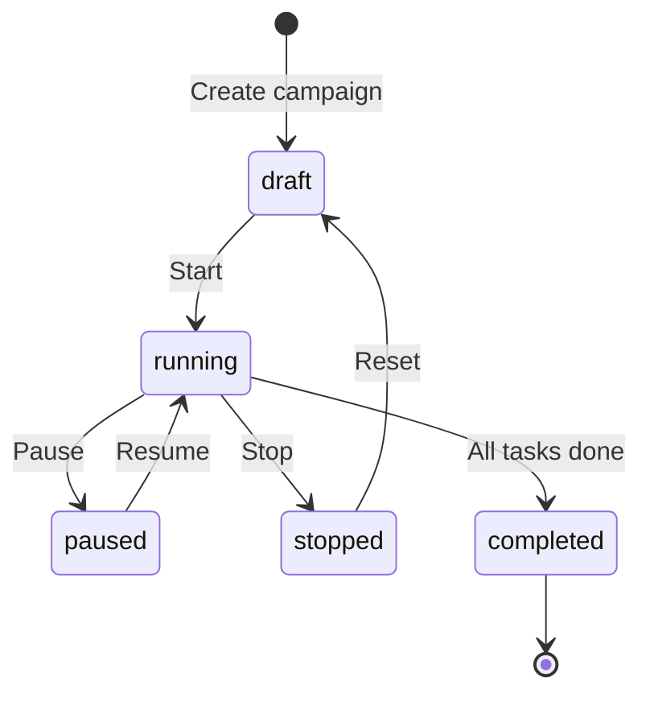

# Campaign Orchestration API

## Overview

Implement campaign CRUD endpoints with lifecycle management, DAG validation, and progress caching to support campaign creation and monitoring.

## Scope

**In Scope:**
- Implement campaign CRUD endpoints with project scoping
- Add campaign lifecycle transitions (draft → running → paused → stopped → completed)
- Implement DAG validation (cycle detection) in backend
- Add attack configuration endpoints
- Implement campaign progress caching (updated on task events)
- Add campaign start/pause/stop endpoints with confirmation logic
- Update `file:packages/backend/src/routes/dashboard/campaigns.ts` and `file:packages/backend/src/services/campaigns.ts`

**Out of Scope:**
- Campaign templates
- Campaign cloning
- Advanced scheduling (start at specific time)

## Acceptance Criteria

1. **Campaign CRUD**
   - `POST /api/v1/dashboard/campaigns` creates campaign in `draft` status
   - `GET /api/v1/dashboard/campaigns` returns project-scoped campaigns with filters (status, priority)
   - `GET /api/v1/dashboard/campaigns/:id` returns campaign with attacks and progress
   - `PUT /api/v1/dashboard/campaigns/:id` updates campaign (only in `draft` status)
   - `DELETE /api/v1/dashboard/campaigns/:id` deletes campaign (only in `draft` status)

2. **Campaign Lifecycle**
   - `POST /api/v1/dashboard/campaigns/:id/start` transitions `draft → running`
   - `POST /api/v1/dashboard/campaigns/:id/pause` transitions `running → paused`
   - `POST /api/v1/dashboard/campaigns/:id/resume` transitions `paused → running`
   - `POST /api/v1/dashboard/campaigns/:id/stop` transitions to `stopped` (cancels tasks, returns to draft)
   - Campaign automatically transitions to `completed` when all tasks finish

3. **DAG Validation**
   - Backend validates attack dependencies for cycles before campaign creation
   - Uses topological sort algorithm to detect cycles
   - Returns 400 error with cycle details if validation fails
   - Validates that all dependency IDs reference attacks in the same campaign

4. **Attack Configuration**
   - Attacks created with campaign (transactional)
   - Each attack specifies: `mode`, `hash_type_id`, `wordlist_id`, `rulelist_id`, `masklist_id`, `dependencies`
   - Attack `dependencies` is integer array of attack IDs
   - Advanced configuration stored in `advanced_configuration` JSONB field

5. **Campaign Progress Caching**
   - Campaign record includes cached `progress` JSONB field:
     - `percentage`: Overall completion percentage (0-100)
     - `eta`: Estimated time to completion (ISO timestamp)
     - `tasks_total`: Total task count
     - `tasks_completed`: Completed task count
     - `tasks_failed`: Failed task count
   - Progress updated when tasks complete or report progress
   - Calculation: `(completed_tasks + sum(task_progress)) / total_tasks`

6. **Campaign Start Logic**
   - Validates campaign has at least one attack
   - Validates all referenced resources exist (hash list, wordlists, etc.)
   - Triggers task generation (sync or async based on size)
   - Updates campaign status to `running`
   - Emits `campaign_status` event

## Technical Notes

**DAG Validation Algorithm:**
```typescript
function validateDAG(attacks: Attack[]): boolean {
  const graph = new Map<number, number[]>();
  attacks.forEach(a => graph.set(a.id, a.dependencies));

  // Topological sort (Kahn's algorithm)
  const inDegree = new Map<number, number>();
  attacks.forEach(a => inDegree.set(a.id, 0));

  attacks.forEach(a => {
    a.dependencies.forEach(depId => {
      inDegree.set(depId, (inDegree.get(depId) || 0) + 1);
    });
  });

  const queue = attacks.filter(a => inDegree.get(a.id) === 0);
  let processed = 0;

  while (queue.length > 0) {
    const current = queue.shift()!;
    processed++;

    current.dependencies.forEach(depId => {
      inDegree.set(depId, inDegree.get(depId)! - 1);
      if (inDegree.get(depId) === 0) {
        queue.push(attacks.find(a => a.id === depId)!);
      }
    });
  }

  return processed === attacks.length; // No cycle if all processed
}
```

**Campaign Lifecycle State Machine:**


**Progress Calculation:**
```typescript
async function updateCampaignProgress(campaignId: number) {
  const tasks = await db.query.tasks.findMany({
    where: eq(tasks.campaignId, campaignId),
  });

  const total = tasks.length;
  const completed = tasks.filter(t => t.status === 'completed').length;
  const failed = tasks.filter(t => t.status === 'failed').length;
  const inProgress = tasks.filter(t => t.status === 'running');

  const progressSum = inProgress.reduce((sum, t) => sum + (t.progress?.percentage || 0), 0);
  const percentage = ((completed + progressSum / 100) / total) * 100;

  const avgSpeed = calculateAverageSpeed(tasks);
  const remainingWork = total - completed - (progressSum / 100);
  const eta = new Date(Date.now() + (remainingWork / avgSpeed) * 1000);

  await db.update(campaigns).set({
    progress: { percentage, eta, tasks_total: total, tasks_completed: completed, tasks_failed: failed }
  }).where(eq(campaigns.id, campaignId));
}
```

## Dependencies

- `ticket:f4542d0d-b9bd-4e50-b90b-9141e8063a18/T5` (Task Distribution & Assignment)
- `ticket:f4542d0d-b9bd-4e50-b90b-9141e8063a18/T7` (Project Selection & User Auth)
- `ticket:f4542d0d-b9bd-4e50-b90b-9141e8063a18/T8` (Resource Management API)

## Spec References

- `spec:f4542d0d-b9bd-4e50-b90b-9141e8063a18/9332598a-b507-42ee-8e71-6a8e43712c16` (Tech Plan → Campaign Orchestration)
- `spec:f4542d0d-b9bd-4e50-b90b-9141e8063a18/9332598a-b507-42ee-8e71-6a8e43712c16` (Tech Plan → Campaign progress calculation decision)
- `spec:f4542d0d-b9bd-4e50-b90b-9141e8063a18/98662419-66d0-40ee-a788-e5aa8c4c4de5` (Core Flows → Flow 4: Campaign Management)
