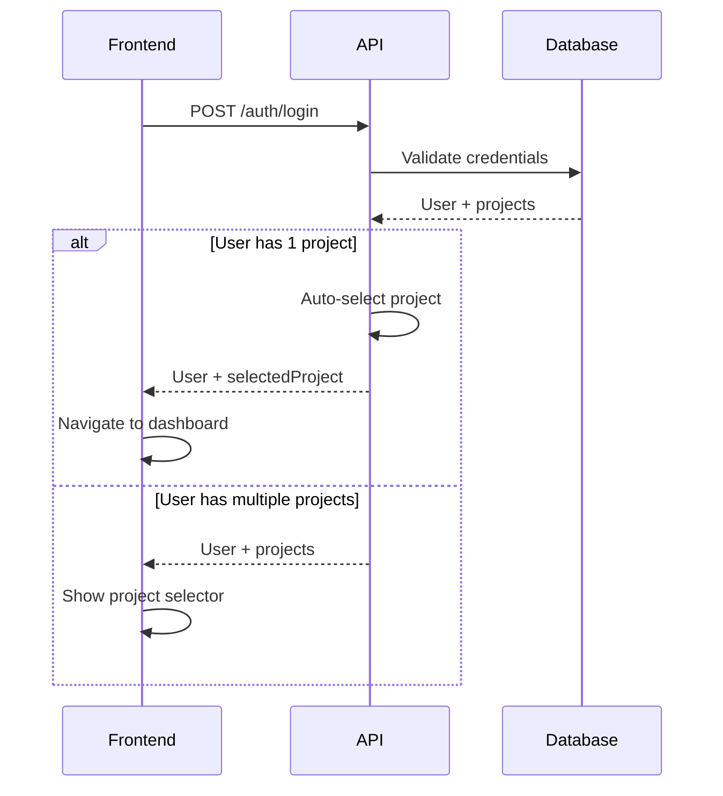

# Project Selection & User Authentication API

## Overview

Implement user authentication with JWT + HttpOnly sessions, project selection with auto-select logic, and RBAC enforcement for the dashboard API.

## Scope

**In Scope:**
- Implement user login/logout with JWT + HttpOnly sessions
- Add project selector endpoint with auto-select logic (single project → skip to dashboard)
- Implement project-scoped middleware for dashboard API
- Add RBAC enforcement (Admin/Operator/Analyst roles)
- Add "remember last project" logic
- Update `file:packages/backend/src/routes/dashboard/auth.ts` and `file:packages/backend/src/middleware/rbac.ts`

**Out of Scope:**
- User management UI (admin creates users manually for v1)
- Multi-factor authentication
- Password reset flow

## Acceptance Criteria

1. **User Login**
   - `POST /api/v1/dashboard/auth/login` accepts email and password
   - Validates credentials against `users` table (bcrypt password hash)
   - Generates JWT token with user ID, email, roles
   - Sets HttpOnly session cookie with JWT
   - Returns user object with projects

2. **User Logout**
   - `POST /api/v1/dashboard/auth/logout` clears session cookie
   - Invalidates JWT token (optional: add to blacklist)

3. **Project Selection**
   - `GET /api/v1/dashboard/projects` returns user's accessible projects
   - `POST /api/v1/dashboard/projects/select` sets current project in session
   - Auto-select logic: if user has only one project, automatically select it
   - "Remember last project" stored in user preferences

4. **Project-Scoped Middleware**
   - Dashboard API middleware validates session cookie
   - Extracts user context: `{ userId, projectId, roles }`
   - Injects context into request for route handlers
   - Returns 401 if session is invalid or expired

5. **RBAC Enforcement**
   - **Admin**: Full access (manage users/projects, create/run campaigns, manage resources, view results)
   - **Operator**: Create/run campaigns, manage resources, view results (no user/project management)
   - **Analyst**: Create campaigns/resources, view results (no user/project management)
   - RBAC middleware checks user roles before allowing access to protected endpoints

## Technical Notes

**JWT Payload:**
```typescript
interface JWTPayload {
  userId: number;
  email: string;
  roles: string[];
  projectId?: number; // Set after project selection
  iat: number;
  exp: number;
}
```

**Session Cookie:**
- HttpOnly flag set (prevents XSS)
- Secure flag set in production (HTTPS only)
- SameSite=Strict (CSRF protection)
- 7-day expiration

**RBAC Middleware:**
```typescript
export const requireRole = (allowedRoles: string[]) => {
  return async (c: Context, next: Next) => {
    const user = c.get('user');
    const hasRole = user.roles.some(role => allowedRoles.includes(role));

    if (!hasRole) {
      return c.json({ error: 'Forbidden' }, 403);
    }

    await next();
  };
};
```

**Auto-Select Logic:**


## Dependencies

None (can run in parallel)

## Spec References

- `spec:f4542d0d-b9bd-4e50-b90b-9141e8063a18/98662419-66d0-40ee-a788-e5aa8c4c4de5` (Core Flows → Flow 1: Login & Project Selection)
- `spec:f4542d0d-b9bd-4e50-b90b-9141e8063a18/9332598a-b507-42ee-8e71-6a8e43712c16` (Tech Plan → Authentication & Authorization Flow)
- `spec:f4542d0d-b9bd-4e50-b90b-9141e8063a18/98662419-66d0-40ee-a788-e5aa8c4c4de5` (Core Flows → RBAC policy)
