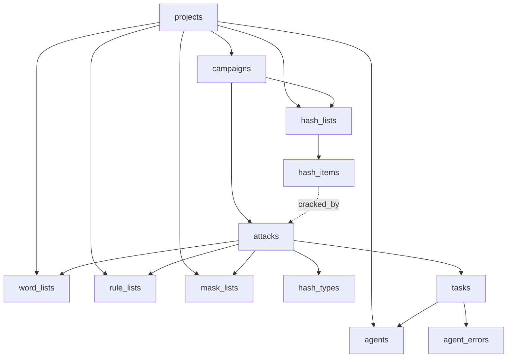
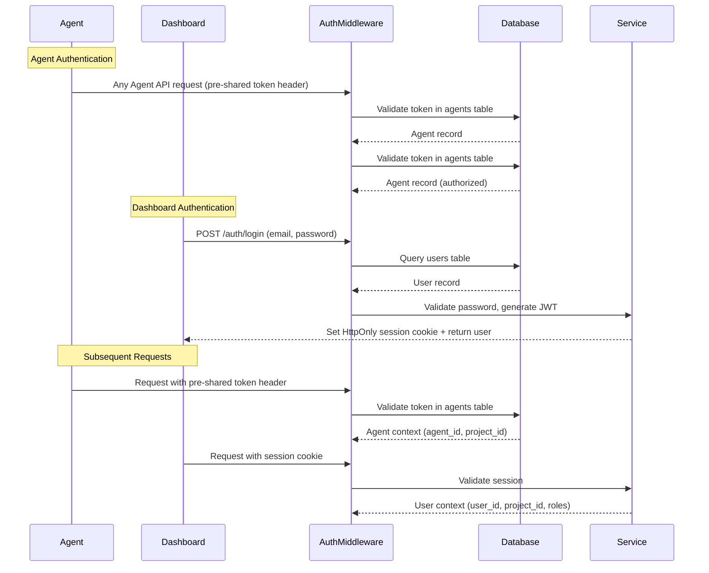
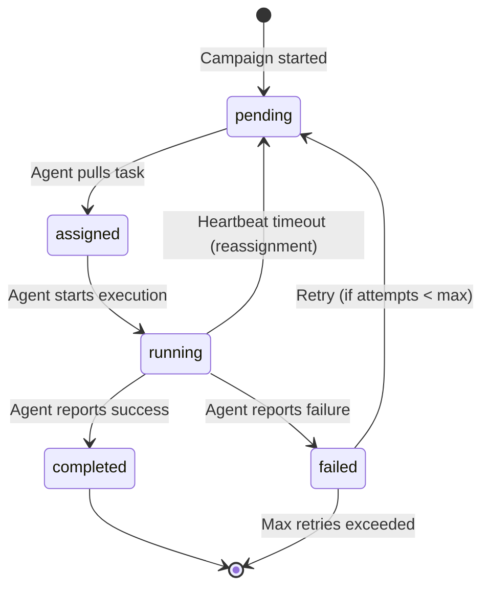
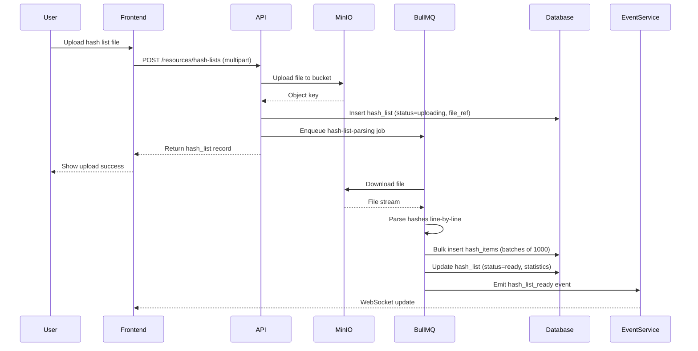

# Tech Plan: HashHive Architecture

## Architectural Approach

### Technology Stack

**Backend:**

- **Runtime**: Bun (latest stable) as JavaScript runtime, package manager, and test runner
- **Framework**: Hono running natively on `Bun.serve()` with zero adapter overhead
- **Database**: PostgreSQL with Drizzle ORM for type-safe queries and migrations
- **Task Queue**: Redis + BullMQ for asynchronous task generation and hash list parsing
- **Storage**: MinIO (S3-compatible) for binary artifacts (hash lists, wordlists, rulelists, masklists)
- **Real-time**: hono/websocket with in-memory broadcasting for v1; document Redis pub/sub as the multi-instance extension path
- **Validation**: Zod schemas generated from Drizzle tables via drizzle-zod

**Frontend:**

- **Framework**: React 19 + Vite (SPA, no meta-framework)
- **UI**: Tailwind CSS + shadcn/ui components
- **Data Fetching**: TanStack Query v5 for server state with automatic caching and refetch
- **State Management**: Zustand for client-side UI state (project selection, filters, wizard state)
- **Forms**: React Hook Form + Zod resolvers using shared schemas
- **Real-time**: WebSocket client with automatic polling fallback on disconnect

**Infrastructure:**

- **Monorepo**: Turborepo with Bun workspaces (packages: backend, frontend, shared, openapi)
- **Tooling**: Biome for linting/formatting, bun:test for all tests
- **Deployment**: Single instance for v1, architecture supports multi-instance via Redis pub/sub

### Schema-First Architecture

**Single Source of Truth Flow:**

```
Drizzle table definitions (shared/db/schema.ts)
  ↓ drizzle-kit generate
Migrations (shared/db/migrations/)
  ↓ drizzle-zod
Zod schemas (shared/schemas/)
  ↓ z.infer<typeof schema>
TypeScript types (shared/types/)
```

**Rationale**: Eliminates duplicate type definitions. Database schema drives API validation and frontend types. Changes to data model automatically propagate through the stack.

**Trade-off**: Tight coupling between database schema and API contracts. Schema changes require coordinated updates across backend and frontend.

### Dual API Surface Design

**Agent API** (`/api/v1/agent/*`)

- **Authentication**: Pre-shared tokens sent on every request (no agent session/JWT exchange)
- **Contract**: OpenAPI specification at file:openapi/agent-api.yaml (single source of truth)
- **Operations**: Batch-oriented (bulk hash submissions, bulk task reports)
- **Consumers**: Go-based hashcat agents (external, version-locked)
- **Stability**: High (breaking changes require agent redeployment across all rigs)

**Dashboard API** (`/api/v1/dashboard/*`)

- **Authentication**: JWT tokens + HttpOnly session cookies
- **Contract**: Standard REST with Zod validation
- **Operations**: CRUD-oriented (low traffic, 1-3 concurrent users)
- **Consumers**: React frontend (same codebase, shares types)
- **Stability**: Medium (frontend and backend deploy together)

**Rationale**: Agents are the primary API consumer and define the contract. Dashboard API can evolve faster since it's coupled to the frontend. Separate authentication mechanisms reflect different security models (long-lived agent tokens vs short-lived user sessions).

**Trade-off**: Maintaining two authentication systems adds complexity, but allows independent evolution of agent and dashboard experiences.

### Asynchronous Processing Strategy

**BullMQ Queue Architecture:**

- **Priority Queues**: `tasks:high`, `tasks:normal`, `tasks:low` (campaign priority determines queue)
- **Job Queues**: `jobs:hash-list-parsing`, `jobs:task-generation` (plus periodic `jobs:heartbeat-monitor` as needed)
- **Worker Processes**: Separate worker processes consume queues independently

**When to Use Async:**

- Hash list parsing (always async via BullMQ)
- Task generation for large campaigns (> 100 tasks threshold)
- Resource-intensive operations that would block HTTP responses

**When to Stay Sync:**

- Task generation for small campaigns (< 100 tasks)
- Simple CRUD operations
- Real-time queries (agent task requests, dashboard stats)

**Rationale**: Async processing prevents HTTP timeouts for long-running operations while keeping simple operations fast. Priority queues ensure high-priority campaigns get resources first.

**Trade-off**: Adds operational complexity (Redis dependency, worker process management) but necessary for responsive UX with large datasets.

**Redis Degradation Policy (v1):**

- **Agent-facing endpoints remain available** when Redis is down (agents can still heartbeat, request work, and report results).
- **Async-dependent dashboard operations are blocked** when Redis is down (e.g., hash list import/parsing, large campaign async task generation).
- **Synchronous small-campaign starts may proceed** if they do not require BullMQ.

### Real-Time Event Architecture

**Event Flow (multi-instance-ready; v1 may shortcut Redis pub/sub):**

```
Service emits event → Redis pub/sub → All backend instances subscribe
  → WebSocket manager broadcasts to connected clients
  → Frontend receives event → TanStack Query invalidates cache → UI updates
```

**Fallback Behavior:**

- WebSocket disconnect detected → Frontend switches to polling mode (30-second intervals)
- Polling continues until WebSocket reconnects
- Connection indicator shows status (connected/disconnected)

**Event Types:**

- `agent_status`: Agent online/offline/error state changes
- `campaign_status`: Campaign started/paused/stopped/completed
- `task_update`: Task progress, completion, failure
- `crack_result`: New hash cracked

**Rationale**: For v1, in-memory broadcasting is the simplest and fits the current codebase. The architecture keeps a clear Redis pub/sub extension path for future multi-instance deployments. Polling fallback ensures dashboard remains functional during network issues.

**Trade-off**: In-memory events won’t propagate across instances. This is acceptable for v1 and explicitly addressed by the Redis pub/sub extension path.

### Task Distribution Model

**Hybrid Pull + Notify:**

- Agents **pull** tasks by calling `POST /api/v1/agent/tasks/next` when ready
- Server **notifies** agents during heartbeat responses if high-priority tasks are available
- Notification is advisory only (agent still pulls to receive task)

**Task Assignment Flow:**

1. Agent requests task via `/tasks/next`
2. Backend queries PostgreSQL for pending tasks scoped to the agent’s project and matching capabilities (predicate applied in the DB query; no post-filtering)
3. Backend assigns task (updates `agent_id`, `assigned_at`, `status = assigned`)
4. Backend returns task descriptor with attack configuration
5. Agent begins execution and reports progress periodically

**Task Reassignment:**

- Heartbeat timeout threshold: 5 minutes (configurable)
- Background job checks for stale assignments every 2 minutes
- Tasks assigned to offline agents return to `pending` status
- Reassigned tasks increment retry counter

**Rationale**: Pull model keeps agents in control of their workload. Heartbeat notifications optimize for high-priority campaigns without requiring persistent connections. PostgreSQL provides transactional task assignment (no race conditions).

**Trade-off**: Polling overhead vs push complexity. Pull model is simpler and more reliable for private lab environment.

---

## Data Model

### Core Entities

The data model is defined in file:packages/shared/src/db/schema.ts using Drizzle table definitions. All tables use `serial` primary keys and `timestamp` fields for audit trails.

**Identity & Access:**

- `users`: email, password_hash, name, status, last_login_at
- `projects`: name, description, slug, settings (jsonb), created_by
- `project_users`: user_id, project_id, roles (text array)

**Agents & Telemetry:**

- `operating_systems`: name, version, platform
- `agents`: name, project_id, operating_system_id, auth_token, status, capabilities (jsonb), hardware_profile (jsonb), last_seen_at
- `agent_errors`: agent_id, severity, message, context (jsonb), task_id

**Campaign Orchestration:**

- `campaigns`: project_id, name, description, hash_list_id, status, priority, metadata (jsonb), started_at, completed_at
- `attacks`: campaign_id, project_id, mode, hash_type_id, wordlist_id, rulelist_id, masklist_id, advanced_configuration (jsonb), keyspace, status, dependencies (integer array)
- `tasks`: attack_id, campaign_id, agent_id, status, work_range (jsonb), progress (jsonb), result_stats (jsonb), assigned_at, started_at, completed_at, failure_reason

**Resources:**

- `hash_types`: name, hashcat_mode, category, example
- `hash_lists`: project_id, name, hash_type_id, source, file_ref (jsonb), statistics (jsonb), status
- `hash_items`: hash_list_id, hash_value, plaintext, cracked_at, metadata (jsonb)
- `word_lists`: project_id, name, file_ref (jsonb), line_count, file_size
- `rule_lists`: project_id, name, file_ref (jsonb), line_count, file_size
- `mask_lists`: project_id, name, file_ref (jsonb), line_count, file_size

### Key Relationships



### JSONB Fields (Flexible Schema)

`**agents.capabilities**`: GPU models, hashcat version, supported modes, device count
`**agents.hardware_profile**`: CPU specs, RAM, OS details, driver versions
`**attacks.advanced_configuration**`: Hashcat flags, optimization settings, custom parameters
`**tasks.work_range**`: Keyspace start/end, skip/limit values
`**tasks.progress**`: Keyspace progress percentage, current speed, temperature
`**tasks.result_stats**`: Hashes attempted, cracked count, rejection count
`**hash_lists.file_ref**`: MinIO bucket (env/config-driven), object key, content type, size
`**hash_lists.statistics**`: Total count, cracked count, crack rate, last updated

**Rationale**: JSONB provides schema flexibility for agent-specific data and attack configurations without requiring migrations for every hashcat version update.

### Indexes for Hot Paths

- `tasks(status, agent_id)`: Agent task queries
- `tasks(campaign_id, status)`: Campaign progress aggregation
- `hash_items(hash_list_id, hash_value)` (unique): Import idempotency and fast membership checks
  - `hash_items(hash_value)`: Hash lookup during crack result ingestion
- `hash_items(hash_list_id, cracked_at)`: Crack rate calculations
- `agents(project_id, status)`: Agent list filtering
- `campaigns(project_id, status)`: Campaign list filtering

**Rationale**: Optimizes the most frequent query patterns identified in Core Flows (agent task pulling, dashboard stats, campaign monitoring).

---

## Component Architecture

### Backend Components

**API Layer (Hono Routes):**

- **Agent Routes** (`/api/v1/agent/*`): heartbeat, tasks/next, tasks/:id/report, errors
- **Dashboard Routes** (`/api/v1/dashboard/*`): auth, projects, agents, campaigns, resources, hashes, tasks, events
- **Middleware Pipeline**: request-id → security-headers → request-logger → auth → RBAC → route handler

**Service Layer (Optional, Reusable Logic Only):**

- **AuthService**: Login/logout, JWT generation, session management, token validation
- **AgentService**: Registration, capability detection, heartbeat processing, error logging
- **CampaignService**: Lifecycle management (start/pause/stop), DAG validation, progress calculation
- **TaskDistributionService**: Task generation, keyspace partitioning, assignment logic, reassignment
- **ResourceService**: File upload to MinIO, hash list parsing coordination, resource metadata
- **HashAnalysisService**: Hash type detection, hashcat mode mapping, format validation
- **EventService**: Event emission, Redis pub/sub broadcasting, WebSocket connection management

**Data Access:**

- Routes call Drizzle queries directly for simple CRUD
- Routes call Services when logic is reused across multiple endpoints
- Services use Drizzle for all database operations (no raw SQL)

**Background Workers (BullMQ):**

- **Hash List Parser**: Reads file from MinIO, parses hashes, bulk inserts to `hash_items`
- **Task Generator**: Calculates keyspace, partitions into work ranges, creates task records
- **Heartbeat Monitor**: Checks for stale agent assignments, reassigns tasks after grace period

### Frontend Components

**Page Components:**

- Login, Project Selector, Dashboard, Campaign List, Campaign Detail, Campaign Create (wizard), Agent List, Agent Detail, Resources (tabbed), Results

**Feature Components:**

- Layout (sidebar + main), Sidebar (navigation + project selector), Protected Route, Stat Card, Status Badge, Connection Indicator

**Data Hooks (TanStack Query):**

- `useDashboardStats()`, `useAgents()`, `useCampaigns()`, `useResources()`, `useEvents()`
- Each hook wraps API calls with caching, refetch, and error handling

**State Stores (Zustand):**

- **authStore**: Current user, session token, login/logout actions
- **uiStore**: Selected project ID, sidebar collapsed state, filter preferences
- **campaignWizardStore**: Multi-step wizard state (basic info, attacks, DAG)

**Real-time Integration:**

- `useEvents()` hook establishes WebSocket connection
- On event received, invalidates relevant TanStack Query cache keys
- TanStack Query automatically refetches affected data
- UI updates reactively via React re-renders

### Authentication & Authorization Flow



**RBAC Policy:**

- **Admin**: Full access (manage users/projects, create/run campaigns, manage resources, view results)
- **Operator**: Create/run campaigns, manage resources, view results (no user/project management)
- **Analyst**: Create campaigns/resources, view results (no user/project management)

**Project Scoping:**

- All data queries filtered by `project_id` from user context
- Middleware injects `currentUser` with `userId`, `projectId`, `roles` into request context
- Routes enforce project-scoped access via WHERE clauses

### Task Distribution Architecture

**Task Lifecycle:**



**Task Generation (Hybrid Sync/Async):**

- Campaign start triggers task generation
- IF campaign has < 100 estimated tasks: generate synchronously in HTTP request
- IF campaign has ≥ 100 estimated tasks: enqueue `task-generation` job to BullMQ
- Task generation calculates keyspace from attack configuration, partitions into work ranges
- Tasks inserted into PostgreSQL with `status = pending`
- Tasks enqueued to BullMQ priority queues (`tasks:high`, `tasks:normal`, `tasks:low`)

**Task Assignment (Pull + Notify):**

- Agent calls `POST /api/v1/agent/tasks/next` when ready for work
- Backend queries PostgreSQL for pending tasks scoped to the agent’s project and matching capabilities (DB-level predicate; no post-filtering)
- Backend assigns task (atomic update: `status = assigned`, `agent_id = X`, `assigned_at = now()`)
- Backend returns task descriptor with attack configuration and work range
- During heartbeat, backend includes `has_high_priority_tasks` flag if urgent work available

**Task Reassignment (Background Job):**

- BullMQ worker runs every 2 minutes
- Queries tasks with `status = assigned` and `assigned_at < now() - 5 minutes`
- Checks if agent's `last_seen_at < now() - 5 minutes` (offline)
- Resets task to `status = pending`, clears `agent_id`, increments retry counter
- Re-enqueues task to appropriate priority queue

**Rationale**: Hybrid approach balances responsiveness (small campaigns start immediately) with scalability (large campaigns don't block HTTP). Pull model keeps agents stateless and resilient to network issues. PostgreSQL provides transactional task assignment without race conditions.

**Trade-off**: BullMQ adds operational complexity (Redis dependency, worker processes) but enables reliable async processing and priority-based scheduling.

### Real-Time Event Propagation

**Event Emission:**

- Services emit events after state changes (campaign started, task completed, hash cracked)
- **v1:** EventService broadcasts locally (in-memory)
  - **future:** EventService can publish to Redis pub/sub (`hashhive:events`) for multi-instance
- **future:** all backend instances subscribe to Redis channel (multi-instance only)
- WebSocket manager receives events and broadcasts to connected clients

**Client Subscription:**

- Frontend establishes WebSocket connection to `/events/stream`
- Backend authenticates WebSocket via session cookie
- Client subscribes to project-scoped events
- On event received, client invalidates TanStack Query cache
- TanStack Query refetches affected data automatically

**Fallback Mechanism:**

- Frontend detects WebSocket disconnect (connection indicator turns gray)
- Frontend switches to polling mode (30-second intervals)
- Polling calls same REST endpoints as normal data fetching
- When WebSocket reconnects, polling stops

**Rationale**: Redis pub/sub enables multi-instance deployments (future-proofing) while maintaining simple WebSocket management. Polling fallback ensures dashboard remains functional during network issues. TanStack Query cache invalidation provides reactive UI updates without manual state management.

**Trade-off**: Redis dependency for single-instance v1 is overhead, but provides clean scaling path. Polling fallback adds API load during disconnects.

### Resource Storage Architecture

**File Upload Flow:**



**Storage Strategy:**

- All binary artifacts stored in MinIO (hash lists, wordlists, rulelists, masklists)
- Database stores metadata + MinIO object reference in `file_ref` JSONB field
- `file_ref` structure: `{ bucket, key, contentType, size, uploadedAt }` where `bucket` is env/config-driven (12-factor)
- Agents download resources directly from MinIO using presigned URLs

**Rationale**: MinIO provides S3-compatible API, enabling future migration to AWS S3 if needed. Separating binary storage from PostgreSQL keeps database focused on relational data. Presigned URLs enable direct agent downloads without proxying through backend.

**Trade-off**: MinIO adds operational dependency, but necessary for managing large wordlists (multi-GB files) that don't belong in PostgreSQL.

### Error Handling & Recovery

**Agent Error Classification:**

- **Warning**: Logged to `agent_errors`, task continues (e.g., temperature spike, driver reset)
- **Fatal**: Logged to `agent_errors`, task fails (e.g., hashcat crash, invalid configuration)

**Task Failure Handling:**

- Task reports `status = failed` with error message
- IF retry count < 3: task returns to `pending`, re-enqueued to BullMQ
- IF retry count ≥ 3: task marked `failed` permanently, campaign continues
- Campaign fails only if ALL tasks fail

**Campaign Progress Calculation:**

- Campaign record includes cached `progress` field (percentage, ETA)
- Updated when tasks complete or report progress
- Calculation: `(completed_tasks + sum(task_progress)) / total_tasks`
- ETA calculated from average task completion rate

**Rationale**: Cached progress avoids expensive aggregation queries on every dashboard load. Retry logic handles transient failures (network issues, temporary agent problems). Campaign continues even with failed tasks to maximize crack coverage.

**Trade-off**: Cached progress may be slightly stale (updated on task events, not real-time), but acceptable for dashboard UX.

---

## Component Architecture

### Backend Service Responsibilities

**AuthService:**

- User login/logout with password validation
- JWT token generation and validation
- Session management (create, validate, destroy)
- Agent token validation (pre-shared tokens in `agents.auth_token`)

**AgentService:**

- Agent registration with capability detection
- Heartbeat processing (update `last_seen_at`, status transitions)
- Agent error logging with severity classification
- Capability matching for task assignment

**CampaignService:**

- Campaign CRUD operations with project scoping
- Campaign lifecycle transitions (draft → running → paused → completed)
- DAG validation (cycle detection, dependency resolution)
- Progress calculation and caching

**TaskDistributionService:**

- Task generation from attack keyspace calculations
- Keyspace partitioning strategies (linear, random, optimized)
- Task assignment with capability matching
- Task reassignment for offline agents
- Retry logic for failed tasks

**ResourceService:**

- File upload to MinIO with metadata storage
- Hash list parsing coordination (enqueue BullMQ job)
- Resource access control (project-scoped)
- Presigned URL generation for agent downloads

**HashAnalysisService:**

- Hash type detection using name-that-hash library
- Hashcat mode mapping and validation
- Confidence scoring for hash type candidates

**EventService:**

- Event emission with type-safe event schemas
- In-memory broadcasting (v1)
- Optional Redis pub/sub (future multi-instance)
- WebSocket connection management
- Project-scoped event filtering

### Frontend Architecture

**Data Flow:**

```
User Action → Page Component → Hook (TanStack Query) → API Call
  → Backend Response → TanStack Query Cache → Component Re-render

WebSocket Event → useEvents Hook → Cache Invalidation
  → TanStack Query Refetch → Component Re-render
```

**State Management Strategy:**

- **Server State**: TanStack Query (campaigns, agents, resources, stats)
- **UI State**: Zustand (selected project, filters, wizard progress)
- **Form State**: React Hook Form (campaign wizard, resource uploads)

**Component Boundaries:**

- Pages orchestrate data fetching and layout
- Feature components are presentational (receive props, emit events)
- Hooks encapsulate API calls and caching logic
- Stores manage cross-page UI state

### Integration Points

**Backend ↔ Database:**

- Drizzle client configured with connection pooling
- Transactions used for multi-table operations (campaign + attacks creation)
- Migrations applied via `drizzle-kit migrate` on deployment

**Backend ↔ Redis:**

- BullMQ connection for task queues
- Redis is required for BullMQ background jobs (task generation, hash import)
- Separate Redis clients per concern (BullMQ; and optionally pub/sub later) to isolate failures

**Backend ↔ MinIO:**

- S3 client configured with MinIO endpoint
- Bucket per resource type (`hash-lists`, `wordlists`, `rulelists`, `masklists`)
- Presigned URLs with 1-hour expiration for agent downloads

**Frontend ↔ Backend:**

- TanStack Query configured with base URL and auth interceptors
- WebSocket connection authenticated via session cookie
- Automatic retry with exponential backoff for failed requests

**Agent ↔ Backend:**

- OpenAPI contract at file:openapi/agent-api.yaml defines all endpoints
- Contract tests validate backend responses against OpenAPI spec
- Agents use pre-shared tokens for authentication
- Batch operations for hash submissions (array of results in single request)

### Critical Design Decisions

**1. Schema-First Development**

- All data shapes defined in Drizzle tables
- Zod schemas generated via drizzle-zod (no manual duplication)
- TypeScript types inferred from Zod schemas
- **Impact**: Schema changes require coordinated updates, but eliminates type drift

**2. Dual Authentication Model**

- Agents use pre-shared tokens (long-lived, provisioned during agent setup)
- Dashboard users use JWT + HttpOnly sessions (short-lived, refreshable)
- **Impact**: Two auth code paths, but appropriate for different security models

**3. Hybrid Sync/Async Processing**

- Small operations synchronous (fast feedback)
- Large operations async via BullMQ (prevent timeouts)
- **Impact**: Complexity in determining sync vs async threshold, but necessary for UX

**4. PostgreSQL as Primary Queue**

- Tasks stored in PostgreSQL with status/indexes
- BullMQ used for job orchestration, not task storage
- **Impact**: PostgreSQL becomes bottleneck if task volume exceeds expectations, but simpler than dual-storage model

**5. Redis + BullMQ (Async + Future Multi-Instance Path)**

- Redis is required for BullMQ background jobs (task generation, hash import)
- For v1 WebSockets, events broadcast in-memory; Redis pub/sub is the documented extension path for multi-instance
- **Impact**: Redis becomes a required dependency for async workflows; multi-instance support can be added later without rewriting event semantics

**6. DAG Validation in Frontend + Backend**

- Frontend validates for immediate UX feedback
- Backend validates for security and data integrity
- **Impact**: Duplicate validation logic, but necessary for both UX and security

**7. Cached Campaign Progress**

- Progress stored in campaign record, updated on task events
- Avoids expensive aggregation queries
- **Impact**: Slight staleness (eventual consistency), but acceptable for dashboard UX

&nbsp;
