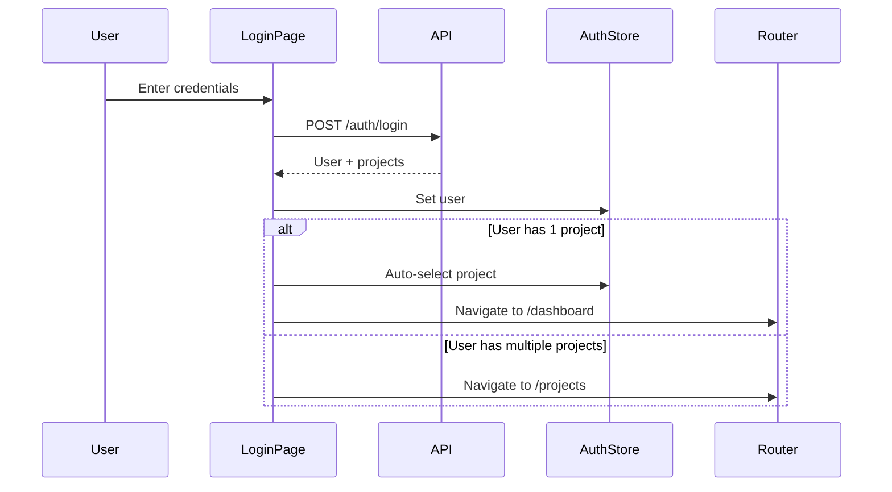

# Login & Project Selection UI

## Overview

Implement login page with authentication and project selector with auto-select logic to provide the entry point for dashboard users.

## Scope

**In Scope:**
- Implement login page with email/password form (React Hook Form + Zod validation)
- Add project selector page with project cards (shown when user has multiple projects or no remembered selection)
- Implement auto-select logic (single project → skip selector → dashboard)
- Add "remember last project" preference
- Update protected route wrapper to **require a selected project** (redirect to selector when missing)
  - Keep the **sidebar project dropdown** for switching projects after initial selection
- Add logout functionality in user menu
- Update `file:packages/frontend/src/pages/login.tsx` and create project selector page

**Out of Scope:**
- User registration (admin creates users manually)
- Password reset flow
- Multi-factor authentication

## Acceptance Criteria

1. **Login Page**
   - Email and password input fields with validation
   - "Remember me" checkbox (optional)
   - Submit button calls `POST /api/v1/dashboard/auth/login`
   - On success, stores user in auth store (Zustand)
   - On success with single project, navigates to dashboard
   - On success with multiple projects, navigates to project selector
   - Displays error messages for invalid credentials

2. **Project Selector Page**
   - Displays project cards with name, description, role
   - Clicking project card calls `POST /api/v1/dashboard/projects/select`
   - On success, stores selected project in auth store
   - Navigates to dashboard
   - "Remember last project" checkbox (stores preference)

3. **Auto-Select Logic**
   - If user has only one project, automatically select it after login
   - Skip project selector page and navigate directly to dashboard
   - If user has multiple projects and "remember last project" is enabled, auto-select last project

4. **Protected Route Wrapper**
   - Wraps all dashboard pages
   - Checks if user is authenticated (auth store)
   - Redirects to login if not authenticated
   - Checks if project is selected
   - Redirects to project selector if no project selected

5. **Logout Functionality**
   - Logout button in user menu (top-right)
   - Calls `POST /api/v1/dashboard/auth/logout`
   - Clears auth store
   - Navigates to login page

## Technical Notes

**Login Form Validation:**
```typescript
const loginSchema = z.object({
  email: z.string().email('Invalid email address'),
  password: z.string().min(8, 'Password must be at least 8 characters'),
});

type LoginForm = z.infer<typeof loginSchema>;
```

**Auth Store (Zustand):**
```typescript
interface AuthState {
  user: User | null;
  selectedProject: Project | null;
  login: (email: string, password: string) => Promise<void>;
  selectProject: (projectId: number) => Promise<void>;
  logout: () => Promise<void>;
}
```

**Protected Route:**
```typescript
function ProtectedRoute({ children }: { children: React.ReactNode }) {
  const { user, selectedProject } = useAuthStore();

  if (!user) return <Navigate to="/login" />;
  if (!selectedProject) return <Navigate to="/projects" />;

  return <>{children}</>;
}
```

**Auto-Select Flow:**


## Dependencies

- `ticket:f4542d0d-b9bd-4e50-b90b-9141e8063a18/T7` (Project Selection & User Auth API)

## Spec References

- `spec:f4542d0d-b9bd-4e50-b90b-9141e8063a18/98662419-66d0-40ee-a788-e5aa8c4c4de5` (Core Flows → Flow 1: Login & Project Selection)
- `spec:f4542d0d-b9bd-4e50-b90b-9141e8063a18/98662419-66d0-40ee-a788-e5aa8c4c4de5` (Core Flows → Wireframes: Login, Project Selector)
