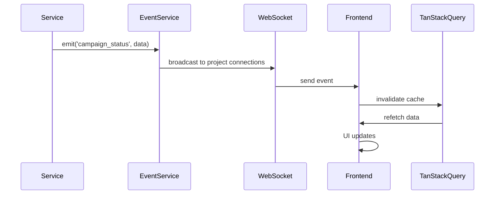

# Real-Time Events & WebSocket Infrastructure

## Overview

Implement in-memory WebSocket broadcasting for real-time dashboard updates with automatic polling fallback, documenting the Redis pub/sub extension path for future multi-instance deployments.

## Scope

**In Scope:**
- Implement in-memory WebSocket broadcasting via EventService
- Add WebSocket authentication (**cookie primary**; optional `token` query param fallback for non-browser clients)
- Implement project-scoped event filtering
- Add connection indicator to frontend (subtle, always visible)
- Implement automatic polling fallback on WebSocket disconnect (30-second intervals)
- Document Redis pub/sub extension path for multi-instance in code comments and architecture docs
- Update `file:packages/backend/src/services/events.ts`

**Out of Scope:**
- Redis pub/sub implementation (future multi-instance)
- Event replay/history
- Event persistence

## Acceptance Criteria

1. **WebSocket Server**
   - WebSocket endpoint at `/events/stream` using `hono/websocket`
   - Authenticates connections via session cookie when present; supports `?token=<session-jwt>` fallback for non-browser clients
   - Maintains in-memory map of connections by project ID
   - Broadcasts events only to connections in the same project

2. **Event Types**
   - `agent_status`: Agent online/offline/error state changes
   - `campaign_status`: Campaign started/paused/stopped/completed
   - `task_update`: Task progress, completion, failure
   - `crack_result`: New hash cracked

3. **Event Emission**
   - Services emit events after state changes (e.g., `eventService.emit('campaign_status', { campaignId, status })`)
   - EventService broadcasts to all connected clients in the same project
   - Events include timestamp and project ID

4. **Frontend Integration**
   - Connection indicator shows WebSocket status (connected/disconnected)
   - On disconnect, frontend switches to polling mode (30-second intervals)
   - On reconnect, polling stops and WebSocket resumes
   - TanStack Query cache invalidated on event receipt

5. **Redis Pub/Sub Extension Path**
   - Code comments document how to extend to Redis pub/sub
   - Architecture decision documented in Tech Plan
   - EventService designed to support both in-memory and Redis pub/sub (interface abstraction)

## Technical Notes

**Current Implementation:**
- `file:packages/backend/src/services/events.ts` has in-memory WebSocket broadcasting
- Need to ensure project-scoped filtering and session-based auth

**Event Flow:**


**Polling Fallback:**
- Frontend detects WebSocket close event
- Switches to polling same REST endpoints (e.g., `/api/v1/dashboard/stats`)
- Polls every 30 seconds until WebSocket reconnects

**Redis Pub/Sub Extension (Future):**
```typescript
// Future multi-instance support
// EventService publishes to Redis channel
await redis.publish('hashhive:events', JSON.stringify(event));

// All backend instances subscribe
redis.subscribe('hashhive:events', (message) => {
  const event = JSON.parse(message);
  websocketManager.broadcast(event);
});
```

## Dependencies

None (foundation layer)

## Spec References

- `spec:f4542d0d-b9bd-4e50-b90b-9141e8063a18/9332598a-b507-42ee-8e71-6a8e43712c16` (Tech Plan → Real-Time Event Architecture)
- `spec:f4542d0d-b9bd-4e50-b90b-9141e8063a18/98662419-66d0-40ee-a788-e5aa8c4c4de5` (Core Flows → Navigation & Layout)
