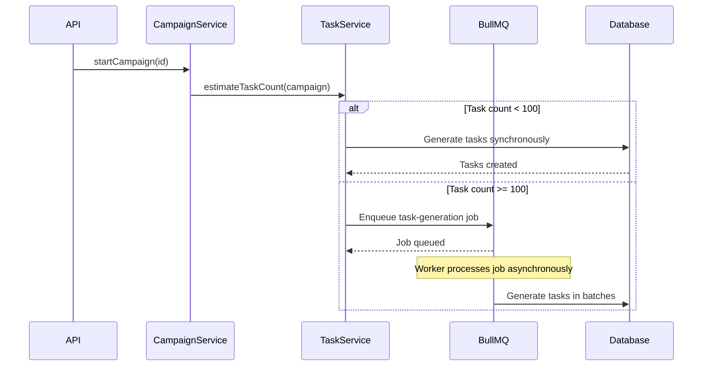

# Task Distribution & Assignment

## Overview

Implement strict task assignment with project scoping and capability matching, hybrid task generation (sync/async based on size), and task reassignment for offline agents.

## Scope

**In Scope:**
- Implement strict task assignment query (project scope + capability matching in DB predicate, no post-filtering)
- Add hybrid task generation (sync for < 100 tasks, async via BullMQ for ≥ 100 tasks)
- Implement task reassignment background job (5-minute heartbeat timeout)
- Add task retry logic (max 3 retries)
- Implement task priority queuing (high/normal/low based on campaign priority)
- Add heartbeat notification for high-priority tasks
- Update `file:packages/backend/src/services/tasks.ts`

**Out of Scope:**
- Advanced keyspace optimization strategies
- Task preemption (stopping running tasks for higher priority)
- Dynamic task splitting

## Acceptance Criteria

1. **Strict Task Assignment**
   - Task query filters by `project_id` and agent capabilities in the WHERE clause (no post-filtering)
   - Query uses indexes on `tasks(status, project_id)` for performance
   - Assignment is atomic (UPDATE with WHERE conditions to prevent race conditions)
   - Returns `null` if no matching tasks available

2. **Hybrid Task Generation**
   - Campaign start calculates estimated task count
   - IF task count < 100: generate tasks synchronously in HTTP request
   - IF task count ≥ 100: enqueue `jobs:task-generation` job to BullMQ
   - Task generation partitions keyspace into work ranges
   - Tasks inserted with `status = pending` and enqueued to priority queue

3. **Task Reassignment**
   - Background job runs every 2 minutes via BullMQ
   - Queries tasks with `status = assigned` and `assigned_at < now() - 5 minutes`
   - Checks if agent's `last_seen_at < now() - 5 minutes` (offline)
   - Resets task to `status = pending`, clears `agent_id`, increments retry counter
   - Re-enqueues task to appropriate priority queue

4. **Task Retry Logic**
   - Failed tasks increment retry counter
   - IF retry count < 3: task returns to `pending` status
   - IF retry count ≥ 3: task marked `failed` permanently
   - Campaign continues even with failed tasks

5. **Priority Queuing**
   - Campaign priority (high/normal/low) determines task queue
   - Tasks enqueued to `tasks:high`, `tasks:normal`, or `tasks:low`
   - Higher priority queues processed first

6. **Heartbeat Notification**
   - Heartbeat response includes `has_high_priority_tasks` flag
   - Flag set to `true` if high-priority tasks available for agent's project and capabilities
   - Agent can optionally request task immediately

## Technical Notes

**Current Implementation Issue:**
- `file:packages/backend/src/services/tasks.ts` `assignNextTask()` selects first pending task globally, then checks project scope after
- This can cause "no task" even when agent's project has pending work
- Need to apply project scope and capability matching in the DB query

**Strict Assignment Query:**
```typescript
const task = await db.query.tasks.findFirst({
  where: and(
    eq(tasks.status, 'pending'),
    eq(tasks.projectId, agentProjectId),
    // Capability matching (e.g., GPU required)
    sql`${tasks.capabilities} @> ${agentCapabilities}`
  ),
  orderBy: [desc(tasks.priority), asc(tasks.createdAt)],
});

if (task) {
  await db.update(tasks)
    .set({ status: 'assigned', agentId, assignedAt: new Date() })
    .where(eq(tasks.id, task.id));
}
```

**Task Generation Flow:**


## Dependencies

- `ticket:f4542d0d-b9bd-4e50-b90b-9141e8063a18/T1` (BullMQ Queue Architecture)
- `ticket:f4542d0d-b9bd-4e50-b90b-9141e8063a18/T4` (Agent Authentication)

## Spec References

- `spec:f4542d0d-b9bd-4e50-b90b-9141e8063a18/9332598a-b507-42ee-8e71-6a8e43712c16` (Tech Plan → Task Distribution Model)
- `spec:f4542d0d-b9bd-4e50-b90b-9141e8063a18/9332598a-b507-42ee-8e71-6a8e43712c16` (Tech Plan → Task assignment correctness decision)
- `spec:f4542d0d-b9bd-4e50-b90b-9141e8063a18/98662419-66d0-40ee-a788-e5aa8c4c4de5` (Core Flows → Flow 4: Campaign Management)
